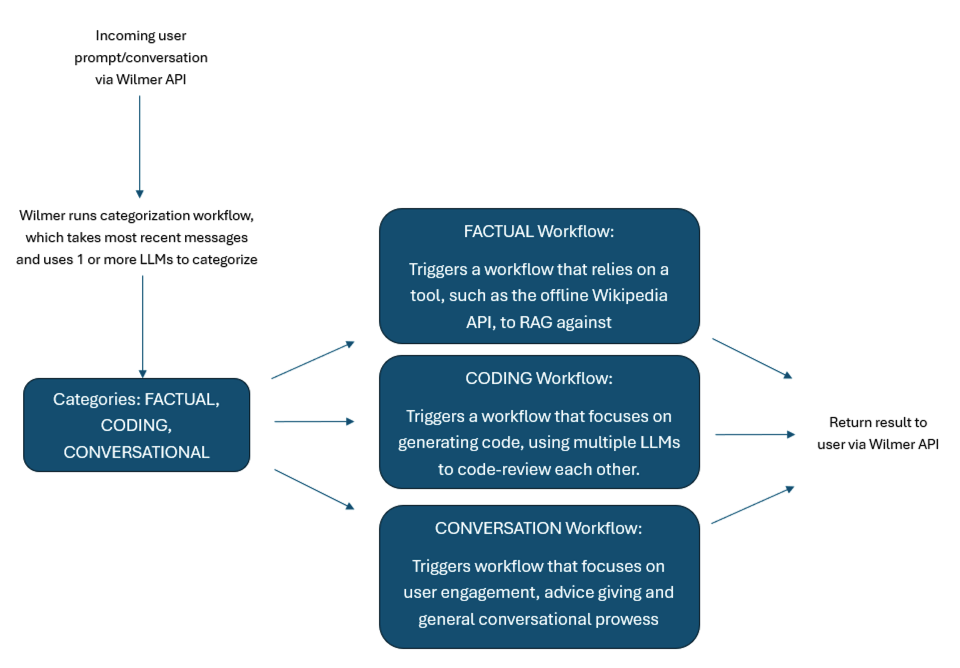
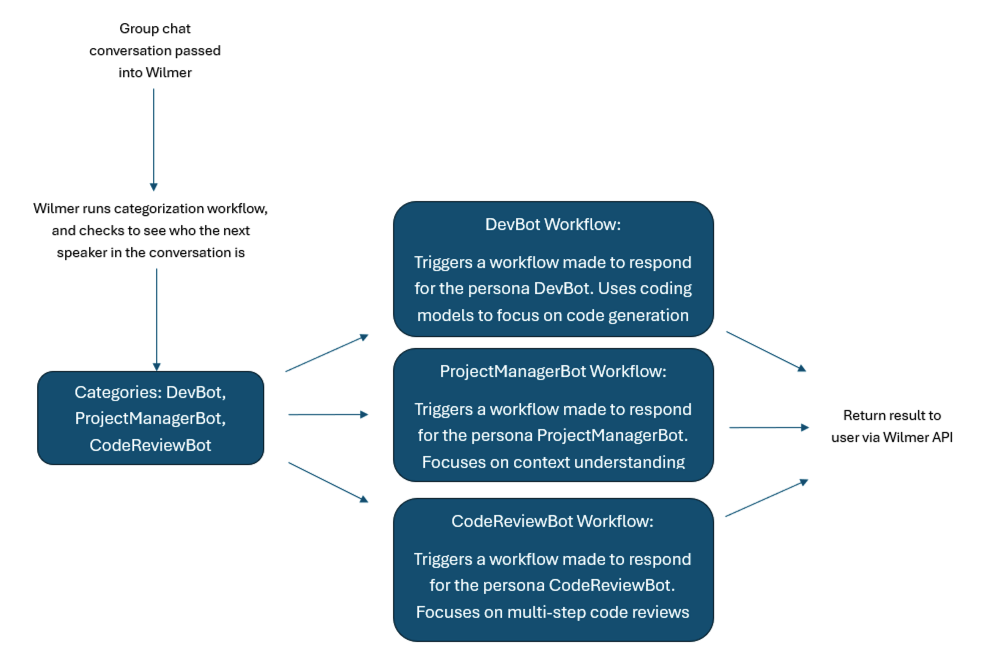
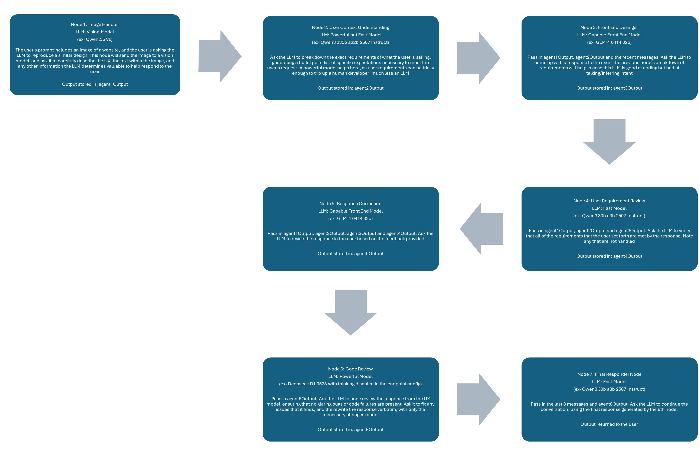

# WilmerAI

*"What If Language Models Expertly Routed All Inference?"*

## DISCLAIMER:

> This project is still under development. The software is provided as-is, without warranty of any kind.
>
> This project and any expressed views, methodologies, etc., found within are the result of contributions by the
> maintainer and any contributors in their free time and on their personal hardware, and should not reflect upon
> any of their employers.

---

## What is WilmerAI?

WilmerAI is an application designed for advanced semantic prompt routing and complex task orchestration. It
originated from the need for a router that could understand the full context of a conversation, rather than just the
most recent message.

Unlike simple routers that might categorize a prompt based on a single keyword, WilmerAI's routing system can analyze
the entire conversation history. This allows it to understand the true intent behind a query like "What do you think it
means?", recognizing it as historical query if that statement was preceded by a discussion about the Rosetta Stone,
rather than merely conversational.

This contextual understanding is made possible by its core: a **node-based workflow engine**. Like the rest of Wilmer
The routing is a workflow, categorizing through a sequence of steps, or "nodes", defined in a JSON file.
The route chosen kicks off another specialized workflow, which can call more workflows from there. Each node can
orchestrate different LLMs, call external tools, run custom scripts, call other workflows, and many other things.

To the client application, this entire multi-step process appears as a standard API call, enabling advanced backend
logic without requiring changes to your existing front-end tools.

---

## Maintainer's Note — UPDATED 2025-09-21

> **IMPORTANT:**  
> Wilmer is once more accepting contributions. A six-month-long refactor was kicked off back in March of
> 2025 to correct long-standing issues that resulted from me learning Python as I was first making this.
> The code is now much easier to work in, is thoroughly documented, and currently has 92% unit test code
> coverage. It's not perfect, but it's a good start. Now that it's out of the way, I can start adding even
> more features and fleshing out the ones that exist.
>
> For most of this year, I've only really had a few hours each weekend to put into this project, but things
> are starting to quite down. As I start to get a bit more free time, I'm hoping I can begin to poking at this
> in the late evenings as well.
>
> To those who are still around: thanks for your patience with me. I've still got a lot of plans for this project,
> and now that my schedule is clearing up, I plan to dig into them.
>
> — Socg

## The Power of Workflows

### Semi-Autonomous Workflows Allow You Determine What Tools and When

The below shows Open WebUI connected to 2 instances of Wilmer. The first instance just hits Mistral Small 3 24b
directly, and then the second instance makes a call to
the [Offline Wikipedia API](https://github.com/SomeOddCodeGuy/OfflineWikipediaTextApi) before making the call to the
same model.

*Click the image to play gif if it doesn't start automatically*

### Iterative LLM Calls To Improve Performance

A zero-shot to an LLM may not give great results, but follow-up questions will often improve them. If you
regularly perform
[the same follow-up questions when doing tasks like software development](https://www.someoddcodeguy.dev/my-personal-guide-for-developing-software-with-ai-assistance/),
creating a workflow to automate those steps can have great results.

### Distributed LLMs

With workflows, you can have as many LLMs available to work together in a single call as you have computers to support.
For example, if you have old machines lying around that can run 3-8b models? You can put them to use as worker LLMs in
various nodes. The more LLM APIs that you have available to you, either on your own home hardware or via proprietary
APIs, the more powerful you can make your workflow network. A single prompt to Wilmer could reach out to 5+ computers,
including proprietary APIs, depending on how you build your workflow.

## Some (Not So Pretty) Pictures to Help People Visualize What It Can Do

#### Example of A Simple Assistant Workflow Using the Prompt Router

#### Example of How Routing Might Be Used

#### Group Chat to Different LLMs

#### Example of a UX Workflow Where A User Asks for a Website

## Key Features

* **Advanced Contextual Routing**
  The primary function of WilmerAI. It directs user requests using sophisticated, context-aware logic. This is handled
  by two mechanisms:
    * **Prompt Routing**: At the start of a conversation, it analyzes the user's prompt to select the most appropriate
      specialized workflow (e.g., "Coding," "Factual," "Creative").
    * **In-Workflow Routing**: During a workflow, it provides conditional "if/then" logic, allowing a process to
      dynamically choose its next step based on the output of a previous node.

  Crucially, these routing decisions can be based on the **entire conversation history**, not just the user's last
  messages, allowing for a much deeper understanding of intent.

---

* **Core: Node-Based Workflow Engine**
  The foundation that powers the routing and all other logic. WilmerAI processes requests using workflows, which are
  JSON files that define a sequence of steps (nodes). Each node performs a specific task, and its output can be passed
  as input to the next, enabling complex, chained-thought processes.

---

* **Multi-LLM & Multi-Tool Orchestration**
  Each node in a workflow can connect to a completely different LLM endpoint or execute a tool. This allows you to
  orchestrate the best model for each part of a task—for example, using a small, fast local model for summarization and
  a large, powerful cloud model for the final reasoning, all within a single workflow.

---

* **Modular & Reusable Workflows**
  You can build self-contained workflows for common tasks (like searching a database or summarizing text) and then
  execute them as a single, reusable node inside other, larger workflows. This simplifies the design of complex agents.

---

* **Stateful Conversation Memory**
  To provide the necessary context for long conversations and accurate routing, WilmerAI uses a three-part memory
  system: a chronological summary file, a continuously updated "rolling summary" of the entire chat, and a searchable
  vector database for Retrieval-Augmented Generation (RAG).

---

* **Adaptable API Gateway**
  WilmerAI's "front door." It exposes OpenAI- and Ollama-compatible API endpoints, allowing you to connect your existing
  front-end applications and tools without modification.

---

* **Flexible Backend Connectors**
  WilmerAI's "back door." It connects to various LLM backends (OpenAI, Ollama, KoboldCpp) using a simple but powerful
  configuration system of **Endpoints** (the address), **API Types** (the schema/driver), and **Presets** (the
  generation parameters).

---

- **MCP Server Tool Integration using MCPO:** New and experimental support for MCP
  server tool calling using MCPO, allowing tool use mid-workflow. Big thank you
  to [iSevenDays](https://github.com/iSevenDays)
  for the amazing work on this feature. More info can be found in the [ReadMe](Public/modules/README_MCP_TOOLS.md)

---

## User Documentation

User Documentation can be found by going to [/Docs/_User_Documentation/](Docs/_User_Documentation/README.md)

## Developer Documentation

Helpful developer docs can be found in [/Docs/Developer_Docs/](Docs/Developer_Docs/README.md)

## Quick-ish Setup

### Youtube Videos

### Guides

#### WilmerAI

Hop into the [User Documents Setup Starting Guide](Docs/_User_Documentation/Setup/_Getting-Start_Wilmer-Api.md) to get
step by step rundown of how to quickly set up the API.

#### Wilmer with Open WebUI

[You can click here to find a written guide for setting up Wilmer with Open WebUI](Docs/_User_Documentation/Setup/Open-WebUI.md)

#### Wilmer With SillyTavern

[You can click here to find a written guide for setting up Wilmer with SillyTavern](Docs/_User_Documentation/Setup/SillyTavern.md).

---

## Why Make WilmerAI?

Wilmer was kicked off in late 2023, during the Llama 2 era, to make maximum use of fine-tunes through routing.
The routers that existed at the time didn't handle semantic routing well- often categorizing was based on a single
word and the last message only; but sometimes a single word isn't enough to describe a category, and the last
message may have too much inferred speech or lack too much context to appropriately categorize on.

Almost immediately after Wilmer was started, it became apparent that just routing wasn't enough: the finetunes were ok,
but nowhere near as smart as proprietary LLMs. However, when the LLMs were forced to iterate on the same task over and
over, the quality of their responses tended to improve (as long as the prompt was well written). This meant that the
optimal result wasn't routing just to have a single LLM one-shot the response, but rather sending the prompt to
something
more complex.

Instead of relying on unreliable autonomous agents, Wilmer became focused on semi-autonomous Workflows, giving the
user granular control of the path the LLMs take, and allow maximum use of the user's own domain knowledge and
experience. This also meant that multiple LLMs could work together, orchestrated by the workflow itself,
to come up with a single solution.

Rather than routing to a single LLM, Wilmer routes to many via a whole workflow.

This has allowed Wilmer's categorization to be far more complex and customizable than most routers. Categorization is
handled by user defined workflows, with as many nodes and LLMs involved as the user wants, to break down the
conversation and determine exactly what the user is asking for. This means the user can experiment with different
prompting styles to try to make the router get the best result. Additionally, the routes are more than just keywords,
but rather full descriptions of what the route entails. Little is left to the LLM's "imagination". The goal is that
any weakness in Wilmer's categorization can be corrected by simply modifying the categorization workflow. And once
that category is chosen? It goes to another workflow.

Eventually Wilmer became more about Workflows than routing, and an optional bypass was made to skip routing entirely.
Because of the small footprint, this means that users can run multiple instances of Wilmer- some hitting a workflow
directly, while others use categorization and routing.

While Wilmer may have been the first of its kind, many other semantic routers have since appeared; some of which are
likely faster and better. But this project will continue to be maintained for a long time to come, as the maintainer
of the project still uses it as his daily driver, and has many more plans for it.

## Wilmer API Endpoints

### How Do You Connect To Wilmer?

Wilmer exposes several different APIs on the front end, allowing you to connect most applications in the LLM space
to it.

Wilmer exposes the following APIs that other apps can connect to it with:

- OpenAI Compatible v1/completions (*requires [Wilmer Prompt Template](Public/Configs/PromptTemplates/wilmerai.json)*)
- OpenAI Compatible chat/completions
- Ollama Compatible api/generate (*requires [Wilmer Prompt Template](Public/Configs/PromptTemplates/wilmerai.json)*)
- Ollama Compatible api/chat

### What Wilmer Can Connect To

On the backend, Wilmer is capable to connecting to various APIs, where it will send its prompts to LLMs. Wilmer
currently is capable of connecting to the following API types:

- OpenAI Compatible v1/completions
- OpenAI Compatible chat/completions
- Ollama Compatible api/generate
- Ollama Compatible api/chat
- KoboldCpp Compatible api/v1/generate (*non-streaming generate*)
- KoboldCpp Compatible /api/extra/generate/stream (*streaming generate*)

Wilmer supports both streaming and non-streaming connections, and has been tested using both Sillytavern
and Open WebUI.

## Maintainer's Note:

> This project is being supported in my free time on my personal hardware. I do not have the ability to contribute to
> this during standard business hours on
> weekdays due to work, so my only times to make code updates are weekends, and some weekday late nights.
>
> If you find a bug or other issue, a fix may take a week or two to go out. I apologize in
> advance if that ends up being the case, but please don't take it as meaning I am not taking the
> issue seriously. In reality, I likely
> won't have the ability to even look at the issue until the following Friday or Saturday.
>
> -Socg

## IMPORTANT:

> Please keep in mind that workflows, by their very nature, could make many calls to an API endpoint based on how you
> set them up. WilmerAI does not track token usage, does not report accurate token usage via its API, nor offer any
> viable
> way to monitor token usage. So if token usage tracking is important to you for cost reasons, please be sure to keep
> track of how many tokens you are using via any dashboard provided to you by your LLM APIs, especially early on as you
> get used to this software.
>
>Your LLM directly affects the quality of WilmerAI. This is an LLM driven project, where the flows and outputs are
> almost
> entirely dependent on the connected LLMs and their responses. If you connect Wilmer to a model that produces lower
> quality outputs, or if your presets or prompt template have flaws, then Wilmer's overall quality will be much lower
> quality as well. It's not much different than agentic workflows in that way.

---

## Contact

For feedback, requests, or just to say hi, you can reach me at:

WilmerAI.Project@gmail.com

---

## Third Party Libraries

WilmerAI imports five libraries within its requirements.txt, and imports the libraries via import statements; it does
not extend or modify the source of those libraries.

The libraries are:

* Flask : https://github.com/pallets/flask/
* requests: https://github.com/psf/requests/
* scikit-learn: https://github.com/scikit-learn/scikit-learn/
* urllib3: https://github.com/urllib3/urllib3/
* jinja2: https://github.com/pallets/jinja
* pillow: https://github.com/python-pillow/Pillow

Further information on their licensing can be found within the README of the ThirdParty-Licenses folder, as well as the
full text of each license and their NOTICE files, if applicable, with relevant last updated dates for each.

## Wilmer License and Copyright

    WilmerAI
    Copyright (C) 2025 Christopher Smith

    This program is free software: you can redistribute it and/or modify
    it under the terms of the GNU General Public License as published by
    the Free Software Foundation, either version 3 of the License, or
    (at your option) any later version.

    This program is distributed in the hope that it will be useful,
    but WITHOUT ANY WARRANTY; without even the implied warranty of
    MERCHANTABILITY or FITNESS FOR A PARTICULAR PURPOSE. See the
    GNU General Public License for more details.

    You should have received a copy of the GNU General Public License
    along with this program.  If not, see <https://www.gnu.org/licenses/>.