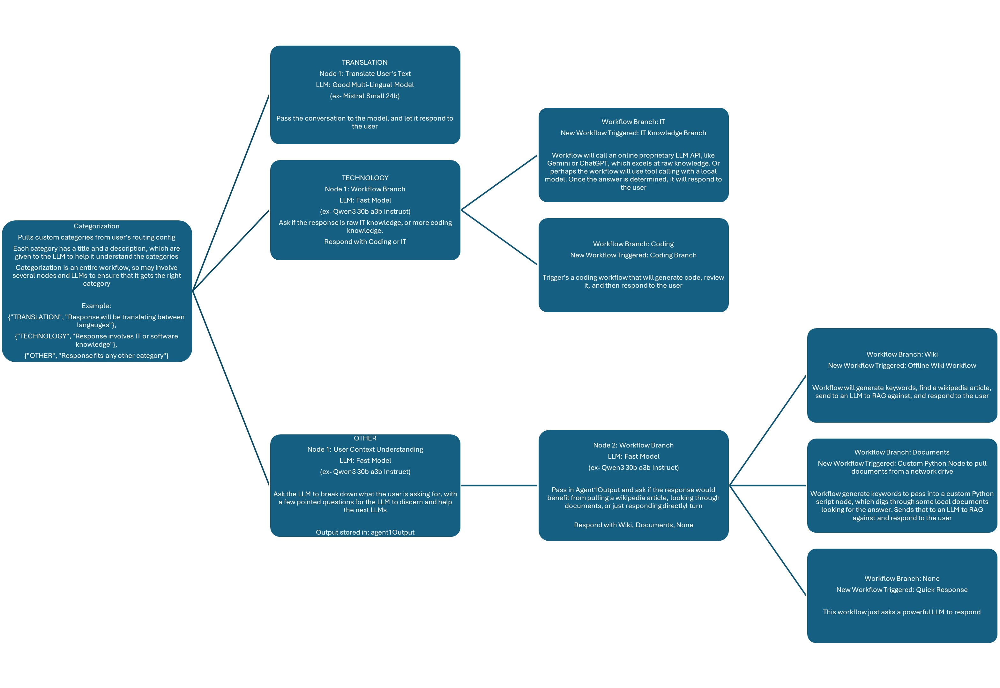
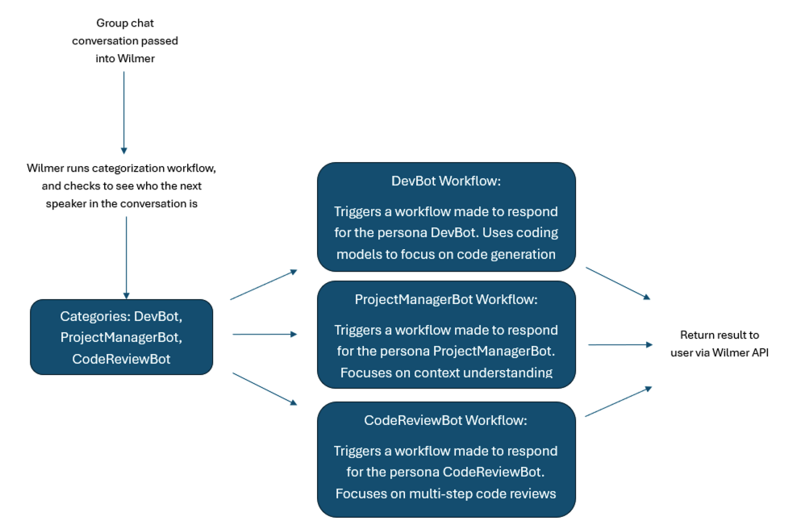
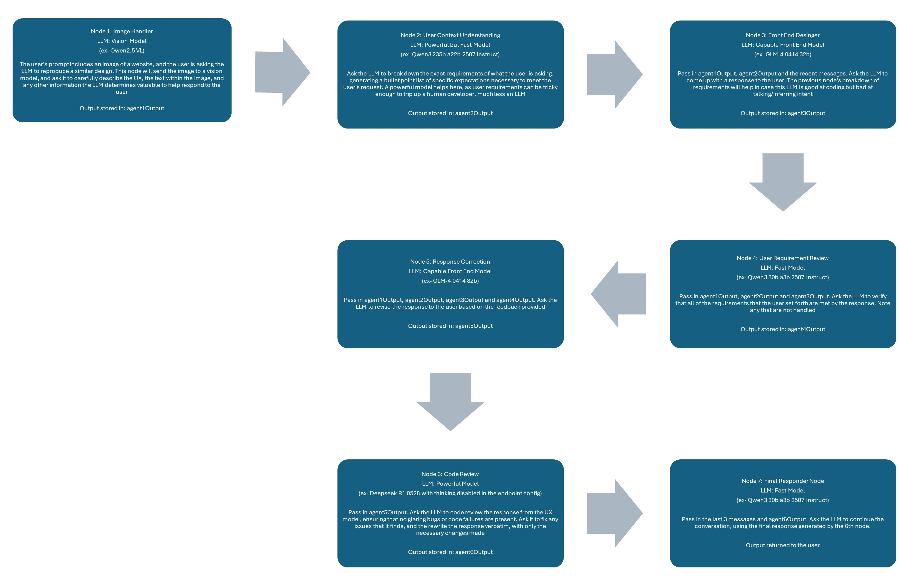

# WilmerAI

*"What If Language Models Expertly Routed All Inference?"*

## DISCLAIMER:

> This is a personal project under heavy development. It could, and likely does, contain bugs, incomplete code,
> or other unintended issues. As such, the software is provided as-is, without warranty of any kind.
>
> This project and any expressed views, methodologies, etc., found within are the result of contributions by the
> maintainer and any contributors in their free time, and should not reflect upon any of their employers.

---

## What is WilmerAI?

WilmerAI is an  application designed for advanced semantic prompt routing and complex task orchestration. It
originated from the need for a router that could understand the full context of a conversation, rather than just the
most recent message.

Unlike simple routers that might categorize a prompt based on a single keyword, WilmerAI's routing system can analyze
the entire conversation history. This allows it to understand the true intent behind a query like "What do you think it
means?", recognizing it as historical query if that statement was preceded by a discussion about the Rosetta Stone,
rather than merely conversational.

This contextual understanding is made possible by its core: a **node-based workflow engine**. Like the rest of Wilmer
The routing is a workflow, categorizing through a sequence of steps, or "nodes", defined in a JSON file.
The route chosen kicks off another specialized workflow, which can call more workflows from there. Each node can
orchestrate different LLMs, call external tools, run custom scripts, call other workflows, and many other things.

To the client application, this entire multi-step process appears as a standard API call, enabling advanced backend
logic without requiring changes to your existing front-end tools.

---

## Maintainer's Note — UPDATED 2025-09-01

> **IMPORTANT:**  
> Until October 2025, WilmerAI will not accept any new Pull Requests that modify anything within the
> Middleware modules; some exceptions may apply. Updates to iSevenDays' new MCP tool-calling feature, or adding new
> custom users or prompt templates within the Public directory, are still welcome.
>
> **Roadmap to Complete Before New PRs Accepted**
> * ~~Reasoning LLM Support (think block removal, prepend text to prompt/system)~~ **(COMPLETE)**
> * ~~Refactor LlmApis~~ **(First Round COMPLETE)**
> * ~~Refactor FrontEnd Apis~~ **(First Round COMPLETE)**
> * ~~Refactor Workflows~~ **(First Round COMPLETE)**
> * ~~Vector Memory Initial Implementation~~ **(COMPLETE)**
> * Rewrite Readme and Expand Documentation *(In progress)*
> * ~~Full Redo of Most Example Users, Using New Prompting Strategies~~ **(COMPLETE)**
> * Second Round Refactoring for Unit Tests
> * Full Unit Test Coverage of Primary Functions
>
> During this time, there are very likely to be new bugs introduced. I really don’t have the ability
> to work on this project during the week at all, so it’s a heads-down code-a-thon on weekends whenever
> I can. Please bear with me if I break stuff along the way over the next few weeks.
>
> To help reduce the pain of this, I’ve finally set up tags/releases, with major checkpoints from the past
> few months chosen so you can grab earlier, better-working versions.
>
> PS: Please bear with me if one of my documents says something dumb. When time is short, documentation usually
> suffers the most, so I’m relying heavily on LLMs right now. Normally I would do it by hand or at least
> proofread it better—so I apologize in advance. I’ll clean that up soon-ish.
>
> — Socg

## The Power of Workflows

### Semi-Autonomous Workflows Allow You Determine What Tools and When

The below shows Open WebUI connected to 2 instances of Wilmer. The first instance just hits Mistral Small 3 24b
directly, and then the second instance makes a call to
the [Offline Wikipedia API](https://github.com/SomeOddCodeGuy/OfflineWikipediaTextApi) before making the call to the
same model.


*Click the image to play gif if it doesn't start automatically*

### Iterative LLM Calls To Improve Performance

A zero-shot to an LLM may not give great results, but follow-up questions will often improve them. If you
regularly
perform [the same follow-up questions when doing tasks like software development](https://github.com/SomeOddCodeGuy/SomeOddCodeGuy/blob/main/Github_Images/My%20personal%20guide%20for%20developing%20software%20with%20AI%20assistance%20r_LocalLLaMA.png),
creating a workflow to
automate those steps can have great results.

### Distributed LLMs

With workflows, you can have as many LLMs available to work together in a single call as you have computers to support.
For example, if you have old machines lying around that can run 3-8b models? You can put them to use as worker LLMs in
various nodes. The more LLM APIs that you have available to you, either on your own home hardware or via proprietary
APIs, the more powerful you can make your workflow network. A single prompt to Wilmer could reach out to 5+ computers,
including proprietary APIs, depending on how you build your workflow.

## Some (Not So Pretty) Pictures to Help People Visualize What It Can Do

#### Example of A Simple Assistant Workflow Using the Prompt Router



#### Example of How Routing Might Be Used


#### Group Chat to Different LLMs



#### Example of a UX Workflow Where A User Asks for a Website



## Key Features

* **Advanced Contextual Routing**
  The primary function of WilmerAI. It directs user requests using sophisticated, context-aware logic. This is handled
  by two mechanisms:
    * **Prompt Routing**: At the start of a conversation, it analyzes the user's prompt to select the most appropriate
      specialized workflow (e.g., "Coding," "Factual," "Creative").
    * **In-Workflow Routing**: During a workflow, it provides conditional "if/then" logic, allowing a process to
      dynamically choose its next step based on the output of a previous node.

  Crucially, these routing decisions can be based on the **entire conversation history**, not just the user's last
  messages, allowing for a much deeper understanding of intent.

---

* **Core: Node-Based Workflow Engine**
  The foundation that powers the routing and all other logic. WilmerAI processes requests using workflows, which are
  JSON files that define a sequence of steps (nodes). Each node performs a specific task, and its output can be passed
  as input to the next, enabling complex, chained-thought processes.

---

* **Multi-LLM & Multi-Tool Orchestration**
  Each node in a workflow can connect to a completely different LLM endpoint or execute a tool. This allows you to
  orchestrate the best model for each part of a task—for example, using a small, fast local model for summarization and
  a large, powerful cloud model for the final reasoning, all within a single workflow.

---

* **Modular & Reusable Workflows**
  You can build self-contained workflows for common tasks (like searching a database or summarizing text) and then
  execute them as a single, reusable node inside other, larger workflows. This simplifies the design of complex agents.

---

* **Stateful Conversation Memory**
  To provide the necessary context for long conversations and accurate routing, WilmerAI uses a three-part memory
  system: a chronological summary file, a continuously updated "rolling summary" of the entire chat, and a searchable
  vector database for Retrieval-Augmented Generation (RAG).

---

* **Adaptable API Gateway**
  WilmerAI's "front door." It exposes OpenAI- and Ollama-compatible API endpoints, allowing you to connect your existing
  front-end applications and tools without modification.

---

* **Flexible Backend Connectors**
  WilmerAI's "back door." It connects to various LLM backends (OpenAI, Ollama, KoboldCpp) using a simple but powerful
  configuration system of **Endpoints** (the address), **API Types** (the schema/driver), and **Presets** (the
  generation parameters).

---

- **MCP Server Tool Integration using MCPO:** New and experimental support for MCP
  server tool calling using MCPO, allowing tool use mid-workflow. Big thank you
  to [iSevenDays](https://github.com/iSevenDays)
  for the amazing work on this feature. More info can be found in the [ReadMe](Public/modules/README_MCP_TOOLS.md)

---

## User Documentation

User Documentation can be found by going to [/Docs/_User_Documentation/](/Docs/_User_Documentation/README.md)

## Developer Documentation

Helpful developer docs can be found in [/Docs/Developer_Docs/](/Docs/Developer_Docs/README.md)

---

## Why Make WilmerAI?

Wilmer was kicked off in late 2023, during the Llama 2 era, to make maximum use of fine-tunes through routing.
The routers that existed at the time didn't handle semantic routing well- often categorizing was based on a single
word and the last message only; but sometimes a single word isn't enough to describe a category, and the last
message may have too much inferred speech or lack too much context to appropriately categorize on.

Almost immediately after Wilmer was started, it became apparent that just routing wasn't enough: the finetunes were ok,
but nowhere near as smart as proprietary LLMs. However, when the LLMs were forced to iterate on the same task over and
over, the quality of their responses tended to improve (as long as the prompt was well written). This meant that the
optimal result wasn't routing just to have a single LLM one-shot the response, but rather sending the prompt to
something
more complex.

Instead of relying on unreliable autonomous agents, Wilmer became focused on semi-autonomous Workflows, giving the
user granular control of the path the LLMs take, and allow maximum use of the user's own domain knowledge and
experience. This also meant that multiple LLMs could work together, orchestrated by the workflow itself,
to come up with a single solution.

Rather than routing to a single LLM, Wilmer routes to many via a whole workflow.

This has allowed Wilmer's categorization to be far more complex and customizable than most routers. Categorization is
handled by user defined workflows, with as many nodes and LLMs involved as the user wants, to break down the
conversation and determine exactly what the user is asking for. This means the user can experiment with different
prompting styles to try to make the router get the best result. Additionally, the routes are more than just keywords,
but rather full descriptions of what the route entails. Little is left to the LLM's "imagination". The goal is that
any weakness in Wilmer's categorization can be corrected by simply modifying the categorization workflow. And once
that category is chosen? It goes to another workflow.

Eventually Wilmer became more about Workflows than routing, and an optional bypass was made to skip routing entirely.
Because of the small footprint, this means that users can run multiple instances of Wilmer- some hitting a workflow
directly, while others use categorization and routing.

While Wilmer may have been the first of its kind, many other semantic routers have since appeared; some of which are
likely faster and better. But this project will continue to be maintained for a long time to come, as the maintainer
of the project still uses it as his daily driver, and has many more plans for it.

## Wilmer API Endpoints

### How Do You Connect To Wilmer?

Wilmer exposes several different APIs on the front end, allowing you to connect most applications in the LLM space
to it.

Wilmer exposes the following APIs that other apps can connect to it with:

- OpenAI Compatible v1/completions (*requires [Wilmer Prompt Template](Public/Configs/PromptTemplates/wilmerai.json)*)
- OpenAI Compatible chat/completions
- Ollama Compatible api/generate (*requires [Wilmer Prompt Template](Public/Configs/PromptTemplates/wilmerai.json)*)
- Ollama Compatible api/chat

### What Wilmer Can Connect To

On the backend, Wilmer is capable to connecting to various APIs, where it will send its prompts to LLMs. Wilmer
currently is capable of connecting to the following API types:

- OpenAI Compatible v1/completions
- OpenAI Compatible chat/completions
- Ollama Compatible api/generate
- Ollama Compatible api/chat
- KoboldCpp Compatible api/v1/generate (*non-streaming generate*)
- KoboldCpp Compatible /api/extra/generate/stream (*streaming generate*)

Wilmer supports both streaming and non-streaming connections, and has been tested using both Sillytavern
and Open WebUI.

## Maintainer's Note:

> This is a passion project that is being supported in my free time. I do not have the ability to contribute to this
> during standard business hours on
> weekdays due to work, so my only times to make code updates are weekends, and some weekday late nights.
>
> If you find a bug or other issue, a fix may take a week or two to go out. I apologize in
> advance if that ends up being the case, but please don't take it as meaning I am not taking the
> issue seriously. In reality, I likely
> won't have the ability to even look at the issue until the following Friday or Saturday.
>
> -Socg

## IMPORTANT:

> Please keep in mind that workflows, by their very nature, could make many calls to an API endpoint based on how you
> set them up. WilmerAI does not track token usage, does not report accurate token usage via its API, nor offer any
> viable
> way to monitor token usage. So if token usage tracking is important to you for cost reasons, please be sure to keep
> track of how many tokens you are using via any dashboard provided to you by your LLM APIs, especially early on as you
> get used to this software.
>
>Your LLM directly affects the quality of WilmerAI. This is an LLM driven project, where the flows and outputs are
> almost
> entirely dependent on the connected LLMs and their responses. If you connect Wilmer to a model that produces lower
> quality outputs, or if your presets or prompt template have flaws, then Wilmer's overall quality will be much lower
> quality as well. It's not much different than agentic workflows in that way.

---

### Connecting in SillyTavern

#### Text Completion

To connect as a Text Completion in SillyTavern, follow these steps (the below screenshot is from SillyTavern):

Connect as OpenAI Compatible v1/Completions:


OR

Connect as Ollama api/generate:


When using text completions, you need to use a WilmerAI-specific Prompt Template format. An importable ST file can be
found within `Docs/SillyTavern/InstructTemplate`. The context template is also included if you'd like to use that as
well.

The instruction template looks like this:

```
[Beg_Sys]You are an intelligent AI Assistant.[Beg_User]SomeOddCodeGuy: Hey there![Beg_Assistant]Wilmer: Hello![Beg_User]SomeOddCodeGuy: This is a test[Beg_Assistant]Wilmer:  Nice.
```

From SillyTavern:

```
    "input_sequence": "[Beg_User]",
    "output_sequence": "[Beg_Assistant]",
    "first_output_sequence": "[Beg_Assistant]",
    "last_output_sequence": "",
    "system_sequence_prefix": "[Beg_Sys]",
    "system_sequence_suffix": "",
```

There are no expected newlines or characters between tags.

Please ensure that Context Template is "Enabled" (checkbox above the dropdown)

#### Chat Completions (Not Recommended)

To connect as Open AI Chat Completions in SillyTavern, follow these steps (the below screenshot is from SillyTavern):


* Once connected, your presets are largely irrelevant and will be controlled by Wilmer; settings like temperature,
  top_k, etc. The only field you need to update is your truncate length. I recommend setting it to the maximum your
  front end will allow; in SillyTavern, that is around 200,000 tokens.
* If you connect via chat/Completion, please go to presets, expand "Character Names Behavior", and set it to "Message
  Content". If you do not do this, then go to your Wilmer user file and set `chatCompleteAddUserAssistant` to true. (I
  don't recommend setting both to true at the same time. Do either character names from SillyTavern, OR user/assistant
  from Wilmer. The AI might get confused otherwise.)

### Additional Recommendations

For either connection type, I recommend going to the "A" icon in SillyTavern and selecting "Include Names" and "Force
Groups and Personas" under instruct mode, and then going to the far left icon (where the samplers are) and checking
"stream" on the top left, and then on the top right checking "unlock" under context and dragging it to 200,000+. Let
Wilmer
worry about the context.

### Connecting in Open WebUI

When connecting to Wilmer from Open WebUI, simply connect to it as if it were an Ollama instance.


## Quick-ish Setup

Wilmer currently has no user interface; everything is controlled via JSON configuration files located in the "Public"
folder. This folder contains all essential configurations. When updating or downloading a new copy of WilmerAI, you
should
simply copy your "Public" folder to the new installation to retain your settings.

This section will walk you through setting up Wilmer. I have broken the sections into steps; I might recommend copying
each step, 1 by 1, into an LLM and asking it to help you set the section up. That may make this go much easier.

### Step 1: Installing the Program

Installing Wilmer is straightforward. Ensure you have Python installed; the author has been using the program with
Python 3.10 and 3.12, and both work well.

**Option 1: Using Provided Scripts**

For convenience, Wilmer includes a BAT file for Windows and a .sh file for macOS. These scripts will create a virtual
environment, install the required packages from `requirements.txt`, and then run Wilmer. You can use these scripts to
start Wilmer each time.

- **Windows**: Run the provided `.bat` file.
- **macOS**: Run the provided `.sh` file.
- **linux**: The author doesn't have a Linux machine and can't test it, so none is provided

> **IMPORTANT:** Never run a BAT or SH file without inspecting it first, as this can be risky. If you are unsure about
> the safety of such a file, open it in Notepad/TextEdit, copy the contents and then ask your LLM to review it for any
> potential issues.

**Option 2: Manual Installation**

Alternatively, you can manually install the dependencies and run Wilmer with the following steps:

1. Install the required packages:
   ```bash
   pip install -r requirements.txt
   ```

2. Start the program:
   ```bash
   python server.py
   ```

The provided scripts are designed to streamline the process by setting up a virtual environment. However, you can safely
ignore them if you prefer manual installation.

#### Script arguments for .bat, .sh and .py files:

**NOTE**: When running either the bat file, the sh file or the python file, all three now accept the following
OPTIONAL arguments:

* "--ConfigDirectory": Directory where your config files can be found. By default, this is the "Public" folder within
  the Wilmer root.
* "--LoggingDirectory": The directory where file logs, if enabled, are stored. Be default file logging is turned OFF,
  and in the event that they are enabled in the user json, they default to going to the "logs" folder in the Wilmer root
* "--User": The user that you want to run under.

So, for example, consider the following possible runs:

* `bash run_macos.sh` (will use user specified in _current-user.json, configs in "Public", logs in "logs")
* `bash run_macos.sh --User "single-model-assistant"` (will default to public for configs and "log" for logs)
* `bash run_macos.sh --ConfigDirectory "/users/socg/Public/configs" --User "single-model-assistant"` (will just
  use default for "logs"
* `bash run_macos.sh --ConfigDirectory "/users/socg/Public/configs" --User "single-model-assistant" --LoggingDirectory
  "/users/socg/wilmerlogs"`

This these optional arguments allow users to spin up multiple instances of WilmerAI, each instance using a different
user profile, logging to a different place, and specifying configs at a different location, if desired.

### Step 2 Fast Route: Use Pre-made Users

Within the Public/Configs you will find a series of folders containing json files. The two that you are
most interested in are the `Endpoints` folder and the `Users` folder.

**NOTE:** The Factual workflow nodes of the `assistant-single-model`, `assistant-multi-model`
and `group-chat-example` users will attempt to utilize the
[OfflineWikipediaTextApi](https://github.com/SomeOddCodeGuy/OfflineWikipediaTextApi)
project to pull full wikipedia articles to RAG against. If you don't have this API, the workflow
should not have any issues, but I personally use this API to help improve the factual responses I get.
You can specify the IP address to your API in the user json of your choice.

First, choose which template user you'd like to use:

* **\_example\_simple\_router\_no\_memory**: This is a simple user that has routing to WIKI, CODING and GENERAL
  categories, each going to a special workflow. Best used with direct and productive front ends like Open WebUI.
  Requires the Offline Wikipedia API

* **\_example\_general\_workflow**: This is a simple user that runs a single general purpose workflow. Simple, to the
  point. Best used with direct and productive front ends like Open WebUI. Requires the Offline Wikipedia API

* **\_example\_coding\_workflow**: This is a simple user that runs a single coding workflow. Simple, to the point. Best
  used with direct and productive front ends like Open WebUI. Requires the Offline Wikipedia API

* **\_example\_wikipedia\_multi\_step\_workflow**: This is a wikipedia search against the Offline Wikipedia API.
  Requires the Offline Wikipedia API

* **\_example\_wikipedia\_multi\_step\_workflow**: This is a wikipedia search against the Offline Wikipedia API, but
  instead of just 1 pass it does a total of 4, attempting to build up extra info for the report. Still very
  experimental; not sure how I feel about the results yet. Requires the Offline Wikipedia API

* **\_example\_assistant\_with\_vector\_memory**: This template is for a simple "assistant" that will diligently think
  through your message via a series of workflow nodes, and will attempt to track important facts in a simple vector
  memory implementation (*EXPERIMENTAL*)

  > This user thinks a LOT, so it's slow and chews up tokens. I recommend using a non-reasoning model with this. Use
  this with a local model or prepare for it to expensive

* **\_example\_game\_bot\_with\_file\_memory**: This is best used with a game front end, like a custom text game
  implementation or SillyTavern. This is an experimental user with the goal of trying to solve some of the common
  complaints or problems that have voiced on various boards. Feedback is welcome.

  > Again this is expensive and thinks a lot. It's very slow.

**IMPORTANT**: Each of the above users call custom workflows pointing to workflows in the _common directory. You can
find other workflows to swap out as well.

Once you have selected the user that you want to use, there are a couple of steps to perform:

1) Update the endpoints for your user under Public/Configs/Endpoints. The example characters are sorted into folders
   for each. The user's endpoint folder is specified at the bottom of their user.json file. You will want to fill in
   every endpoint
   appropriately for the LLMs you are using. You can find some example endpoints under the `_example-endpoints` folder.
    1) **NOTE** Currently, there is best support for standard openai chat completions and v1 completions endpoints, and
       recently KoboldCpp's generate endpoint was added to the mix, since that is the author's favorite to use. If you
       use
       koboldcpp, I HIGHLY recommend turning off context shifting (--noshift). It will absolutely break Wilmer.

2) You will need to set your current user. You can do this when running the bat/sh/py file by using the --User argument,
   or you can do this in Public/Configs/Users/_current-user.json.
   Simply put the name of the user as the current user and save.

3) You will want to open your user json file and peek at the options. Here you can set whether you want streaming or
   not,
   can set the IP address to your offline wiki API (if you're using it), specify where you want your memories/summary
   files
   to go during DiscussionId flows, and also specify where you want the sqllite db to go if you use Workflow Locks.

That's it! Run Wilmer, connect to it, and you should be good to go.

---

## Contact

For feedback, requests, or just to say hi, you can reach me at:

WilmerAI.Project@gmail.com

---

## Third Party Libraries

WilmerAI imports five libraries within its requirements.txt, and imports the libraries via import statements; it does
not extend or modify the source of those libraries.

The libraries are:

* Flask : https://github.com/pallets/flask/
* requests: https://github.com/psf/requests/
* scikit-learn: https://github.com/scikit-learn/scikit-learn/
* urllib3: https://github.com/urllib3/urllib3/
* jinja2: https://github.com/pallets/jinja
* pillow: https://github.com/python-pillow/Pillow

Further information on their licensing can be found within the README of the ThirdParty-Licenses folder, as well as the
full text of each license and their NOTICE files, if applicable, with relevant last updated dates for each.

## Wilmer License and Copyright

    WilmerAI
    Copyright (C) 2025 Christopher Smith

    This program is free software: you can redistribute it and/or modify
    it under the terms of the GNU General Public License as published by
    the Free Software Foundation, either version 3 of the License, or
    (at your option) any later version.

    This program is distributed in the hope that it will be useful,
    but WITHOUT ANY WARRANTY; without even the implied warranty of
    MERCHANTABILITY or FITNESS FOR A PARTICULAR PURPOSE. See the
    GNU General Public License for more details.

    You should have received a copy of the GNU General Public License
    along with this program.  If not, see <https://www.gnu.org/licenses/>.