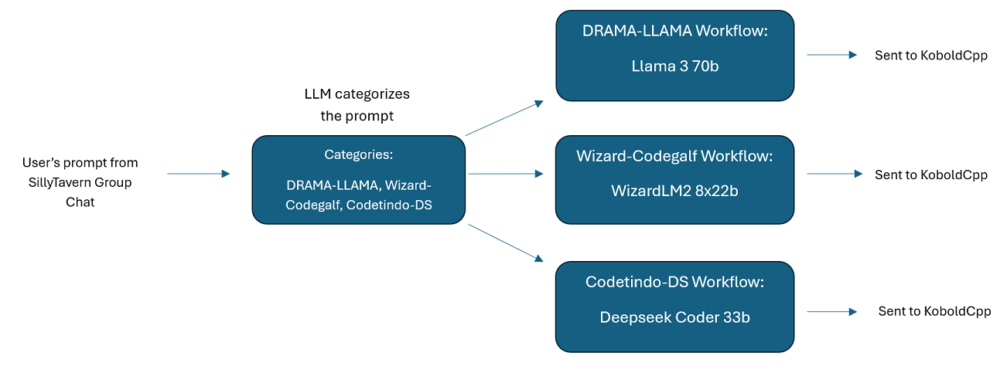
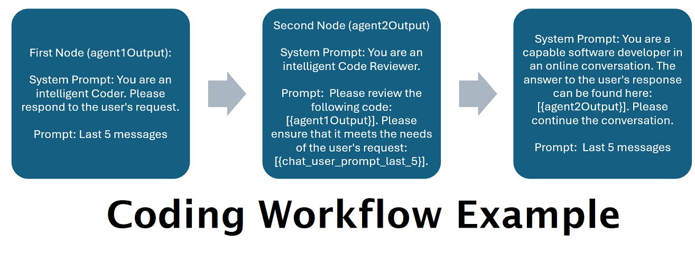
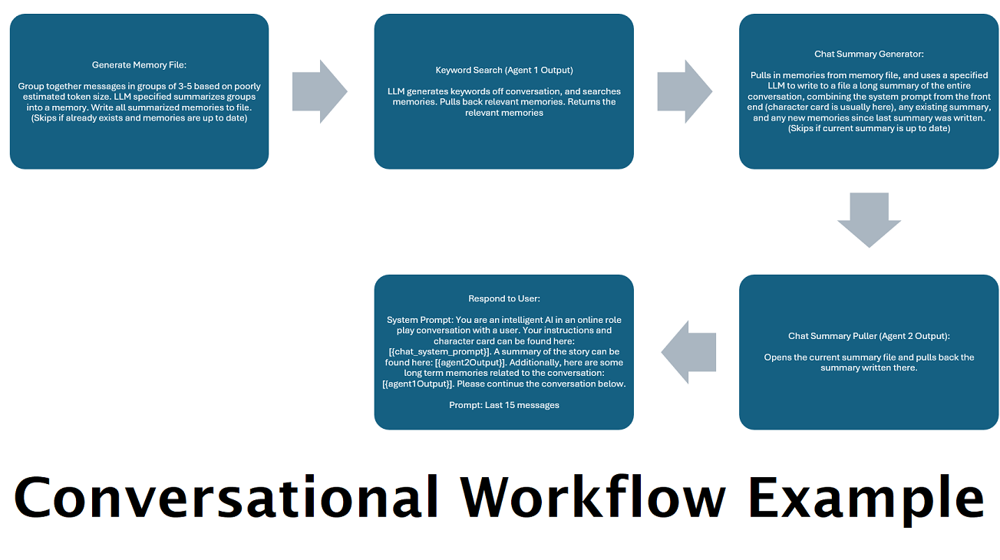
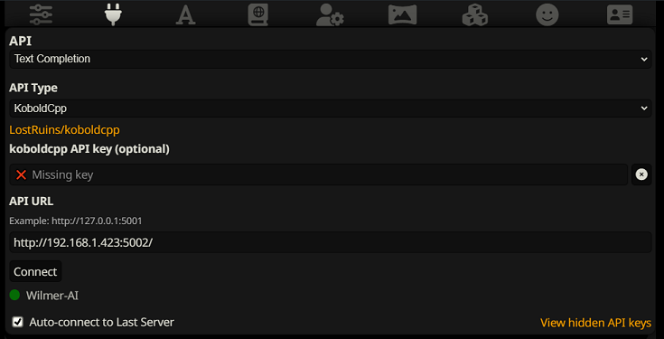
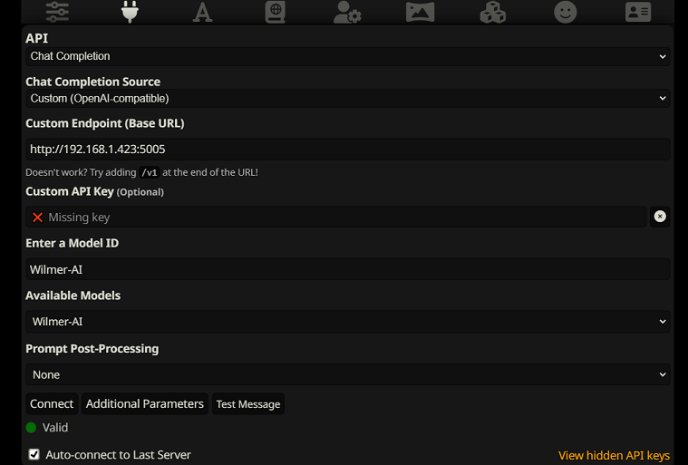
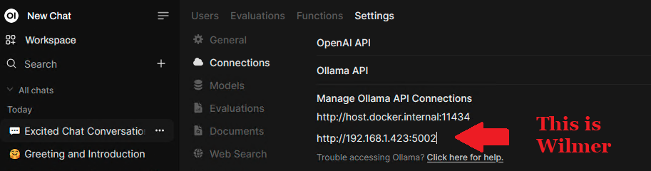
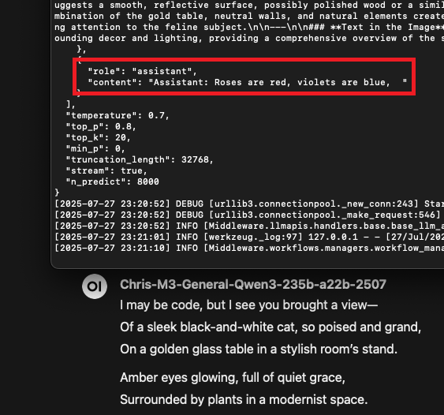

## DISCLAIMER:

> This is a personal project that is under heavy development. It could, and likely does, contain bugs, incomplete code,
> or other unintended issues. As such, the software is provided as-is, without warranty of any kind.
>
> This project and any expressed views, methodologies, etc found within are the result of contributions by the
> maintainer and any contributors in their free time, and should not reflect upon any of their employers.

## Maintainer's Note UPDATED 2025-06-29

> IMPORTANT: Wilmer now more gracefully handles reasoning models, and can strip out thinking blocks of many types
> both mid-workflow, and when returning/streaming to the user. This is a significant improvement for the
> modern LLM landscape. Peek down at the endpoint configs section of the readme for more info. -Socg

> Until September 2025, WilmerAI will not be accepting any new Pull Requests that modify anything within the
> Middleware modules; some exceptions may apply. Updates to iSevenDays' new MCP tool calling feature, or adding new 
> custom users or prompt templates within the Public directory, are still welcome.
> 
> Reasoning behind this:
> - I am going to be doing a large scale refactor of the core Workflow and LLM handler modules to clean them up,
>   make them testable, and make them make sense to others. I started on those files early on, before I had either
>   learned python properly or had Wilmer actually running to help me. Today, my situation is completely different;
>   I have a better understanding of the language, a better grasp on what Wilmer's architecture looks like and I
>   have a pretty extensive Wilmer setup to help me. I will also be redoing the example users.
> - I expect to be exceptionally busy at work for the next few months. I expect this to calm down significantly in 
>   the Fall, but until then I won't have any time during weekdays, and only a little on weekends, to devote to this 
>   project.
> 
>   -Socg

## What is WilmerAI?

WilmerAI sits between your LLM APIs and whatever app is calling them, whether it be a front end like
Open WebUI or SillyTavern, or a python app or an agent. Wilmer can use a prompt router and workflows to allow
you to send a single prompt, conversation, etc through as many LLMs across as many computers as you have access
to, and get back a single response. It can be extended with custom python scripts, meaning you can add whatever
functionality you need to it, even if it isn't currently supported.

Wilmer exposes OpenAI and Ollama compatible endpoints, so it should be connectible to most tools and front ends.

### What Does WilmerAI Stand For?

WilmerAI stands for **"What If Language Models Expertly Routed All Inference?"**

### Youtube Videos

[WilmerAI Setup Tutorial](https://www.youtube.com/watch?v=v2xYQCHZwJM)

This 40 minute video shows:

- A walkthrough of downloading and setting up Wilmer
- Running Wilmer and sending a cURL command to it
- A walkthrough of the wikipedia workflow
- A brief talk of the new Socg users

[WilmerAI Tutorial Youtube PlayList](https://www.youtube.com/playlist?list=PLjIfeYFu5Pl7J7KGJqVmHM4HU56nByb4X)

This 3 hour video series shows:

- A more in-depth walkthrough of Wilmer and what it is
- An explanation of some of the workflows, as well as the custom python script module
- Explaining Socg's personal setup
- Setting up and running an example user
- Showing a run of a workflow on an RTX 4090 that utilizes Ollama's ability to hotswap multiple 14b models,
  allowing a 24GB video card to run as many models that would fit individually on the card as you have hard
  drive space for.

## The Power of Workflows

### RAG injection wherever you need it

The below shows Open WebUI connected to 2 instances of Wilmer. The first instance just hits Mistral Small 3 24b
directly, and then the second instance makes a call to
the [Offline Wikipedia API](https://github.com/SomeOddCodeGuy/OfflineWikipediaTextApi) before making the call to the
same
model.


*Click the image to play gif if it doesn't start automatically*

### Iterative LLM Calls To Improve Performance

A zero-shot to an LLM may not give great results, but follow-up questions will often improve them. If you
regularly
perform [the same follow-up questions when doing tasks like software development](https://github.com/SomeOddCodeGuy/SomeOddCodeGuy/blob/main/Github_Images/My%20personal%20guide%20for%20developing%20software%20with%20AI%20assistance%20r_LocalLLaMA.png),
creating a workflow to
automate those steps can have great results.

The below is the result of running a single zero-shot workflow that has QwQ-32b, Mistral Small 3, and Qwen2.5 32b coder
working together on a result.

`Can you give me a pygame script that shows a ball bouncing inside a spinning hexagon. The ball should be affected by
gravity and friction, and it must bounce off the rotating walls realistically. The ball should be confined inside the
hexagon.`


*Click the image to play gif if it doesn't start automatically*

### Distributed LLMs

With workflows, you can have as many LLMs available to work together in a single call as you have computers to support.
For example, if you have old machines lying around that can run 3-8b models? You can put them to use as worker LLMs in 
various nodes. The more LLM APIs that you have available to you, either on your own home hardware or via proprietary 
APIs, the more powerful you can make your workflow network.

## Wilmer API Endpoints

### How Do You Connect To Wilmer?

Wilmer exposes several different APIs on the front end, allowing you to connect most applications in the LLM space
to it.

Wilmer exposes the following APIs that other apps can connect to it with:

- OpenAI Compatible v1/completions (*requires [Wilmer Prompt Template](Public/Configs/PromptTemplates/wilmerai.json)*)
- OpenAI Compatible chat/completions
- Ollama Compatible api/generate (*requires [Wilmer Prompt Template](Public/Configs/PromptTemplates/wilmerai.json)*)
- Ollama Compatible api/chat

### What Wilmer Can Connect To

On the backend, Wilmer is capable to connecting to various APIs, where it will send its prompts to LLMs. Wilmer
currently is capable of connecting to the following API types:

- OpenAI Compatible v1/completions
- OpenAI Compatible chat/completions
- Ollama Compatible api/generate
- Ollama Compatible api/chat
- KoboldCpp Compatible api/v1/generate (*non-streaming generate*)
- KoboldCpp Compatible /api/extra/generate/stream (*streaming generate*)

Wilmer supports both streaming and non-streaming connections, and has been tested using both Sillytavern
and Open WebUI.

## Key Features

- **Prompt Routing**: Prompts sent into Wilmer can be routed to any custom category, whether that be a domain (like
  coding, math, medical, etc) or a persona name (for groups chats with a different LLM for each persona).


- **Custom Workflows**: Routing isn't required; you can also override the routing so that every prompt goes to a single
  workflow every time.


- **Single Prompts Responded To By Multiple LLMs in tandem**: Every node in a workflow can hit a different LLM if you
  want, so a single prompt could be worked on by 10+ LLMs if that was what you wanted. This means one AI assistant can
  be powered by several workflows, and many LLMs, all working together to generate the best answer.


- **Support For The Offline Wikipedia API**: WilmerAI has a node that can make calls to the
  [OfflineWikipediaTextApi](https://github.com/SomeOddCodeGuy/OfflineWikipediaTextApi), to allow for RAG setups to
  improve factual responses.


- **Continually Generated Chat Summaries to Simulate a "Memory"**: The Chat Summary node will generate "memories",
  by chunking your messages and then summarizing them and saving them to a file. It will then take those summarized
  chunks and generate an ongoing, constantly updating, summary of the entire conversation. This allows conversations
  that far exceed the LLM's context to continue to maintain some level of consistency.


- **Hotswap Models to Maximize VRAM Usage:** Leveraging Ollama's hotswapping, you can run complex workflows even on
  systems with smaller amounts of VRAM. For example, if a 24GB RTX 3090 can load a 14b model, then using endpoints
  pointed towards Ollama, you can have workflows with as many 14b models as your computer has storage to hold, and
  each node that uses a different model will cause Ollama to unload the previous model, and load the new one.


- **Customizable Presets**: Presets are saved in a json file that you can readily customize. Presets are configured in
  json files and sent as-is to the API, so if a new sampler comes out that isn't included in Wilmer, you can just
  pop into the json file for the preset and update it. Each LLM type that Wilmer hits gets its own preset folder.


- **Vision Multi-Modal Support Via Ollama:** Experimental support of image processing when using
  Ollama as the front end API, and having an Ollama backend API to send it to. Send multiple images in a single
  message, even if the LLM itself does not support that; Wilmer will iterate through them and query the LLM
  one at a time. The images can either be utilized as variables for prompts in other workflows, or can be added
  to the conversation as messages.


- **Mid-Workflow Conditional Workflows:** Similar to the main domain routing, you can kick off new workflows inside
  of other workflows, either directly or based on a condition. So you can ask the LLM "Would a Wikipedia article help
  here?", and if the answer is 'yes' then kick off a wikipedia workflow, or if 'no' then kick off a workflow that just
  hits LLMs.

- **MCP Server Tool Integration using MCPO:** New and experimental support for MCP
  server tool calling using MCPO, allowing tool use mid-workflow. Big thank you to [iSevenDays](https://github.com/iSevenDays)
  for the amazing work on this feature. More info can be found in the [ReadMe](Public/modules/README_MCP_TOOLS.md) .

## Maintainer's Note:

> This is a passion project that is being supported in my free time. I do not have the ability to contribute to this
> during standard business hours on
> weekdays due to work, so my only times to make code updates are weekends, and some weekday late nights.
>
> If you find a bug or other issue, a fix may take a week or two to go out. I apologize in
> advance if that ends up being the case, but please don't take it as meaning I am not taking the
> issue seriously. In reality, I likely
> won't have the ability to even look at the issue until the following Friday or Saturday.
>
> -Socg

## Some (Not So Pretty) Pictures to Help People Visualize What It Can Do

#### Single Assistant Routing to Multiple LLMs


#### Silly Tavern Groupchat to Different LLMs



#### An Oversimplified Example Coding Workflow



#### An Oversimplified Conversation/Roleplay Workflow



#### An Oversimplified Python Caller Workflow


## IMPORTANT:

> Please keep in mind that workflows, by their very nature, could make many calls to an API endpoint based on how you
> set them up. WilmerAI does not track token usage, does not report accurate token usage via its API, nor offer any
> viable
> way to monitor token usage. So if token usage tracking is important to you for cost reasons, please be sure to keep
> track of how many tokens you are using via any dashboard provided to you by your LLM APIs, especially early on as you
> get used to this software.
>
>Your LLM directly affects the quality of WilmerAI. This is an LLM driven project, where the flows and outputs are
> almost
> entirely dependent on the connected LLMs and their responses. If you connect Wilmer to a model that produces lower
> quality outputs, or if your presets or prompt template have flaws, then Wilmer's overall quality will be much lower
> quality as well. It's not much different than agentic workflows in that way.

### Connecting in SillyTavern

#### Text Completion

To connect as a Text Completion in SillyTavern, follow these steps (the below screenshot is from SillyTavern):

Connect as OpenAI Compatible v1/Completions:



OR

Connect as Ollama api/generate:


When using text completions, you need to use a WilmerAI-specific Prompt Template format. An importable ST file can be
found within `Docs/SillyTavern/InstructTemplate`. The context template is also included if you'd like to use that as
well.

The instruction template looks like this:

```
[Beg_Sys]You are an intelligent AI Assistant.[Beg_User]SomeOddCodeGuy: Hey there![Beg_Assistant]Wilmer: Hello![Beg_User]SomeOddCodeGuy: This is a test[Beg_Assistant]Wilmer:  Nice.
```

From SillyTavern:

```
    "input_sequence": "[Beg_User]",
    "output_sequence": "[Beg_Assistant]",
    "first_output_sequence": "[Beg_Assistant]",
    "last_output_sequence": "",
    "system_sequence_prefix": "[Beg_Sys]",
    "system_sequence_suffix": "",
```

There are no expected newlines or characters between tags.

Please ensure that Context Template is "Enabled" (checkbox above the dropdown)

#### Chat Completions (Not Recommended)

To connect as Open AI Chat Completions in SillyTavern, follow these steps (the below screenshot is from SillyTavern):



* Once connected, your presets are largely irrelevant and will be controlled by Wilmer; settings like temperature,
  top_k, etc. The only field you need to update is your truncate length. I recommend setting it to the maximum your
  front end will allow; in SillyTavern, that is around 200,000 tokens.
* If you connect via chat/Completion, please go to presets, expand "Character Names Behavior", and set it to "Message
  Content". If you do not do this, then go to your Wilmer user file and set `chatCompleteAddUserAssistant` to true. (I
  don't recommend setting both to true at the same time. Do either character names from SillyTavern, OR user/assistant
  from Wilmer. The AI might get confused otherwise.)

### Additional Recommendations

For either connection type, I recommend going to the "A" icon in SillyTavern and selecting "Include Names" and "Force
Groups and Personas" under instruct mode, and then going to the far left icon (where the samplers are) and checking
"stream" on the top left, and then on the top right checking "unlock" under context and dragging it to 200,000+. Let
Wilmer
worry about the context.

### Connecting in Open WebUI

When connecting to Wilmer from Open WebUI, simply connect to it as if it were an Ollama instance.



## Quick-ish Setup

Wilmer currently has no user interface; everything is controlled via JSON configuration files located in the "Public"
folder. This folder contains all essential configurations. When updating or downloading a new copy of WilmerAI, you
should
simply copy your "Public" folder to the new installation to retain your settings.

This section will walk you through setting up Wilmer. I have broken the sections into steps; I might recommend copying
each step, 1 by 1, into an LLM and asking it to help you set the section up. That may make this go much easier.

**IMPORTANT NOTES**
> It is important to note three things about Wilmer setup.
> * A) Preset files are 100% customizable. What is in that file goes to the llm API. This is because cloud
    APIs do not handle some of the various presets that local LLM APIs handle. As such, if you use OpenAI API
    or other cloud services, the calls will probably fail if you use one of the regular local AI presets. Please
    see the preset "OpenAI-API" for an example of what openAI accepts.
>
>
> * B) I have recently replaced all prompts in Wilmer to go from using the second person to third person. This has
    had pretty decent results for me, and I'm hoping it will for you as well.
>
>
> * C) By default, all the user files are set to turn on streaming responses. You either need to enable
    this in your front end that is calling Wilmer so that both match, or you need to go into Users/username.json
    and set Stream to "false". If you have a mismatch, where the front end does/does not expect streaming and your
    wilmer expects the opposite, nothing will likely show on the front end.

### Step 1: Installing the Program

Installing Wilmer is straightforward. Ensure you have Python installed; the author has been using the program with
Python 3.10 and 3.12, and both work well.

**Option 1: Using Provided Scripts**

For convenience, Wilmer includes a BAT file for Windows and a .sh file for macOS. These scripts will create a virtual
environment, install the required packages from `requirements.txt`, and then run Wilmer. You can use these scripts to
start Wilmer each time.

- **Windows**: Run the provided `.bat` file.
- **macOS**: Run the provided `.sh` file.
- **linux**: The author doesn't have a Linux machine and can't test it, so none is provided

> **IMPORTANT:** Never run a BAT or SH file without inspecting it first, as this can be risky. If you are unsure about
> the safety of such a file, open it in Notepad/TextEdit, copy the contents and then ask your LLM to review it for any
> potential issues.

**Option 2: Manual Installation**

Alternatively, you can manually install the dependencies and run Wilmer with the following steps:

1. Install the required packages:
   ```bash
   pip install -r requirements.txt
   ```

2. Start the program:
   ```bash
   python server.py
   ```

The provided scripts are designed to streamline the process by setting up a virtual environment. However, you can safely
ignore them if you prefer manual installation.

#### Script arguments for .bat, .sh and .py files:

**NOTE**: When running either the bat file, the sh file or the python file, all three now accept the following
OPTIONAL arguments:

* "--ConfigDirectory": Directory where your config files can be found. By default, this is the "Public" folder within
  the Wilmer root.
* "--LoggingDirectory": The directory where file logs, if enabled, are stored. Be default file logging is turned OFF,
  and in the event that they are enabled in the user json, they default to going to the "logs" folder in the Wilmer root
* "--User": The user that you want to run under.

So, for example, consider the following possible runs:

* `bash run_macos.sh` (will use user specified in _current-user.json, configs in "Public", logs in "logs")
* `bash run_macos.sh --User "single-model-assistant"` (will default to public for configs and "log" for logs)
* `bash run_macos.sh --ConfigDirectory "/users/socg/Public/configs" --User "single-model-assistant"` (will just
  use default for "logs"
* `bash run_macos.sh --ConfigDirectory "/users/socg/Public/configs" --User "single-model-assistant" --LoggingDirectory
  "/users/socg/wilmerlogs"`

This these optional arguments allow users to spin up multiple instances of WilmerAI, each instance using a different
user profile, logging to a different place, and specifying configs at a different location, if desired.

### Step 2 Fast Route: Use Pre-made Users

Within the Public/Configs you will find a series of folders containing json files. The two that you are
most interested in are the `Endpoints` folder and the `Users` folder.

**NOTE:** The Factual workflow nodes of the `assistant-single-model`, `assistant-multi-model`
and `group-chat-example` users will attempt to utilize the
[OfflineWikipediaTextApi](https://github.com/SomeOddCodeGuy/OfflineWikipediaTextApi)
project to pull full wikipedia articles to RAG against. If you don't have this API, the workflow
should not have any issues, but I personally use this API to help improve the factual responses I get.
You can specify the IP address to your API in the user json of your choice.

First, choose which template user you'd like to use:

* **assistant-single-model**: This template is for a single small model being used on all nodes. This also has routes
  for many different category types and uses appropriate presets for each
  node. If you're wondering why there are routes for different categories when there is only 1 model: it's so that you
  can
  give each category their own presets, and also so that you can make custom workflows for them. Maybe you want the
  coder to do multiple iterations to check itself, or the reasoning to think through things in multiple steps.


* **assistant-multi-model**: This template is for using many models in tandem. Looking at the endpoints for
  this user, you can see that every category has its own endpoint. There is absolutely nothing stopping you from
  re-using the same API for multiple categories. For example, you might use Llama 3.1 70b for coding, math, and
  reasoning,
  and Command-R 35b 08-2024 for categorization, conversation, and factual. Don't feel like you NEED 10 different models.
  This is simply to allow you to bring that many if you want. This user uses appropriate presets for each node in the
  workflows.


* **convo-roleplay-single-model**: This user uses a single model with a custom workflow that is good for
  conversations,
  and should be good for roleplay (awaiting feedback to tweak if needed). This bypasses all routing.


* **convo-roleplay-dual-model**: This user uses two models with a custom workflow that is good for conversations,
  and should be good for roleplay (awaiting feedback to tweak if needed). This bypasses all routing. **NOTE**: This
  workflow works best if you have 2 computers that can run LLMs. With the current setup for this user, when you send a
  message
  to Wilmer, the responder model (computer 1) will respond to you. Then the workflow will apply a "workflow lock" at
  that
  point. The memory/chat summary model (computer 2) will then begin updating the memories and summary of the
  conversation so far, which is passed to the responder to help it remember stuff. If you were to send another prompt
  while the memories are being written, the responder (computer 1) will grab whatever summary exists and
  go ahead and respond to you. The workflow lock will stop you from re-entering the new memories section. What this
  means is that you can continue talking to your responder model while new memories are being written. This is a HUGE
  performance boost. I've tried it out, and for me the response times were amazing. Without this, I get responses in 30
  seconds 3-5 times, and then suddenly have a 2 minute wait to generate memories. With this, every message is 30
  seconds, every time, on Llama 3.1 70b on my Mac Studio.


* **group-chat-example**: This user is an example of my own personal group chats. The characters and the groups
  included are actual characters and actual groups that I use. You can find the example characters in
  the `Docs/SillyTavern`
  folder. These are SillyTavern compatible characters that you can import directly into that program or any program
  that supports .png character import types. The dev team
  characters have only 1 node per workflow: they simply respond to you. The advisory group characters have 2 nodes
  per workflow: first node generates a response, and the second node enforces the character's "persona" (the endpoint
  in charge of this is the `businessgroup-speaker` endpoint). The group
  chat personas help a lot to vary up the responses you get, even if you use only 1 model. However, I aim to use
  different models for every character (but re-using models between groups; so, for example, I have a Llama 3.1 70b
  model character in each group).


* **openwebui-norouting-single-model**: This user is essentially the convo-roleplay-single-model, but the prompts are
  more tailored for openwebui, which has no concept of a persona.


* **openwebui-norouting-dual-model**: This user is essentially the convo-roleplay-dual-model, but the prompts are
  more tailored for openwebui, which has no concept of a persona.


* **openwebui-routing-multi-model**: This user is essentially the assistant-multi-model, but the prompts are
  more tailored for openwebui, which has no concept of a persona.


* **openwebui-routing-single-model**: This user is essentially the assistant-single-model, but the prompts are
  more tailored for openwebui, which has no concept of a persona.

> NOTE: The below "socg" workflows are (as of 2025-03-09) copies of personal workflows that Socg uses as part of
> his personal development toolkit, though with some minor modifications. For example- these are configured with
> endpoints suitable for a 24GB
> video card, like the RTX 3090. If you have more VRAM, please replace with what is available to you. In general,
> socg uses a different model lineup. This workflow supports images if you use Ollama for the image endpoint.
> Additionally, QwQ 32b just came out and Socg made some last minute updates to these before deploying them to make
> full use of that new model for his own workflows, so if you see any typos or errors, that's why. Finally, socg
> loads models at 32768 context, and doubles all of the maxResponseSizeInTokens in the workflows. They are reduced
> here because the 24GB card would struggle with some models at that context size. If you can use 32k, that will work
> out better, as will doubling all of the maxResponseSizeInTokens within the coding workflows especially.

> IMPORTANT: The below users will be updated semi-often. Pull your configurations out of the main folder if you want
> to use them, or copy them and rename them. As Socg improves his own workflows, those updates will be propagated to
> these users.

* **socg-openwebui-norouting-coding-complex-multi-model**: This user is a coding workflow tends to
  run, with the models that Socg uses on an M2 Ultra Mac Studio, around 20-30 minutes. Generally this is used
  to kick off a request before starting a feature or project, just to get a starting point; this workflow is rarely
  used in the middle of development, unless he'll be going afk for a while and it wouldn't be bothersome, or
  unless some bug is being really aggravating.


* **socg-openwebui-norouting-coding-dual-multi-model**: This user is a coding workflow that relies on 2 models
  working in tandem to try to solve the issue. Much faster than the complex workflow, but still slower than asking
  single LLM.


* **socg-openwebui-norouting-coding-reasoning-multi-model**: Similar to the dual model coding workflow, but this
  expects a reasoning endpoint halfway through. Not a huge difference other than bigger max response sizes and a
  summary node before the responder.


* **socg-openwebui-norouting-coding-single-multi-model**: This calls a single coding model directly. Fastest response;
  not much different than just connecting directly to the LLM API, other than the support for the image endpoints.


* **socg-openwebui-norouting-general-multi-model**: Calls a single general endpoint. This is good for things like RAG.
  Socg runs 3 variants of this: General, Large and Large-Rag (basically just copy/pasted the same user 3 times and
  changed the endpoints). General might be something mid-ranged like Mistral Small 24b or Qwen2.5 32b. Large might be a
  good factual model like Qwen2.5 72b, and Large-Rag would be something with a high IF score like Llama 3.3 70b.


* **socg-openwebui-norouting-general-offline-wikipedia**: This is similar to general-multi-model, but also makes a call
  to the  [OfflineWikipediaTextApi](https://github.com/SomeOddCodeGuy/OfflineWikipediaTextApi) to first pull an article.
  There's still work to do on the efficacy of this, as
  the wiki api can sometimes pull the wrong article. For now, continue to take answers with caution and validate them.

Once you have selected the user that you want to use, there are a couple of steps to perform:

1) Update the endpoints for your user under Public/Configs/Endpoints. The example characters are sorted into folders
   for each. The user's endpoint folder is specified at the bottom of their user.json file. You will want to fill in
   every endpoint
   appropriately for the LLMs you are using. You can find some example endpoints under the `_example-endpoints` folder.
    1) **NOTE** Currently, there is best support for standard openai chat completions and v1 completions endpoints, and
       recently KoboldCpp's generate endpoint was added to the mix, since that is the author's favorite to use. If you
       use
       koboldcpp, I HIGHLY recommend turning off context shifting (--noshift). It will absolutely break Wilmer.

2) You will need to set your current user. You can do this when running the bat/sh/py file by using the --User argument,
   or you can do this in Public/Configs/Users/_current-user.json.
   Simply put the name of the user as the current user and save.

3) You will want to open your user json file and peek at the options. Here you can set whether you want streaming or
   not,
   can set the IP address to your offline wiki API (if you're using it), specify where you want your memories/summary
   files
   to go during DiscussionId flows, and also specify where you want the sqllite db to go if you use Workflow Locks.

That's it! Run Wilmer, connect to it, and you should be good to go.

### Step 2 Slow Route: Endpoints and Models (Learn How to Actually Use the Thing)

First, we'll set up the endpoints and models. Within the Public/Configs folder you should see the following sub-folders.
Let's
walk
through what you need.

#### Endpoints

These configuration files represent the LLM API endpoints you are connected to. For example, the following JSON
file, `SmallModelEndpoint.json`, defines an endpoint:

```json
{
  "modelNameForDisplayOnly": "Small model for all tasks",
  "endpoint": "http://127.0.0.1:5000",
  "apiTypeConfigFileName": "KoboldCpp",
  "maxContextTokenSize": 8192,
  "modelNameToSendToAPI": "",
  "promptTemplate": "chatml",
  "addGenerationPrompt": true,
  "trimBeginningAndEndLineBreaks": true,
  "dontIncludeModel": false,
  "removeThinking": false,
  "thinkTagText": "think",
  "expectOnlyClosingThinkTag": false,
  "addTextToStartOfSystem": true,
  "textToAddToStartOfSystem": "/no_think ",
  "addTextToStartOfPrompt": false,
  "textToAddToStartOfPrompt": "/no_think",
  "addTextToStartOfCompletion": false,
  "textToAddToStartOfCompletion": "<think>\n\n</think>\n\n",
  "ensureTextAddedToAssistantWhenChatCompletion": false
}
```

- **endpoint**: The address of the LLM API that you are connecting to. Must be an openAI compatible API of either
  text Completions or Chat Completions type (if you're unsure- that's the vast majority of APIs, so this will
  probably work with whatever you're trying)
- **apiTypeConfigFileName**: The exact name of the json file from the ApiTypes folder that specifies what type
  of API this is, minus the ".json" extension. "Open-AI-API" will probably work for most cloud services.
- **maxContextTokenSize**: Specifies the max token size that your endpoint can accept
- **modelNameToSendToAPI**: Specifies what model name to send to the API. For cloud services, this can be important.
  For example, OpenAI may expect "gpt-3.5-turbo" here, or something like that. For local AI running in Kobold,
  text-generation-webui, etc., this is mostly unused. (Ollama may use it, though)
- **promptTemplate**: The exact json file name of the prompt template to use, minus the ".json" extension. These
  can be found in the PromptTemplates folder.
- **addGenerationPrompt**: This boolean is for Text Completion endpoints to specify whether the model expects a
  final "assistant" tag at the very end. Not all models do. If you're unsure about this, just set it to
  "false"
- **trimBeginningAndEndLineBreaks**: This boolean will run a trim at the start and end of your prompt, to remove
  any spaces or linebreaks before or after the prompt. Some LLMs don't handle those extra spaces/lines well.
- **dontIncludeModel**: This will NOT send the model name you specify in your endpoint config to the LLM api
  endpoint. Generally, sending that model will tell systems like MLX, Llama.cpp server and Ollama to load the model
  with that name. You may have a reason why you don't want it to do that, and instead have just the model you already
  loaded on that port be used. Setting this to true will stop the model name from being sent, thus not changing
  the loaded model.
- **removeThinking**: This boolean is for reasoning models. By setting this to true, it will completely strip out the
  thinking text from responses coming from LLMs, both for streaming and non-streaming. This is a major fix for Wilmer
  using reasoning models for things like internal, inter-node processing. Socg keeps this on constantly. (NOTE: When
  streaming, this buffers the response to you until thinking is done. That means it looks like the LLM isn't sending
  you anything, but in actuality it's thinking. The moment the thinking is done, this will remove the thinking block
  and start sending you the LLM's response. So as a user, it just looks like the time to first token is FAR longer
  than it is.)
- **thinkTagText**: Allows you to set custom think tags. Some LLMs do things like \<reasoning> or \<thinking> as opposed
  to <think>. With this, each endpoint can account for the specific type of tag it expects
- **expectOnlyClosingThinkTag**: This is for models like Qwen3, which sometimes don't send their opening \<think> tag,
  and instead just start thinking. This will continue to buffer responses until \</think> (or your custom tag) appears,
  at which point it removes everything before that and sends it to you. If no closing tag appears, you will get a dump
  of the whole response at once.
- **addTextToStartOfSystem**: This will add whatever text you put in textToAddToStartOfSystem to the start of the system 
  prompt. Made specifically for the Qwen3 hybrid-thinkers that accept "/no_think ". This will make every prompt run by this
  specific endpoint add that text. In chat/completion, will add it to the first system prompt message.
- **textToAddToStartOfSystem**: The text to add if addTextToStartOfSystem is true. Can be any text you want, probably.
- **addTextToStartOfPrompt**: Same as the one for system, but this adds it to the beginning of the last user 
  message in chat/completion, or the beginning of the whole user prompt in v1/Completion.
- **textToAddToStartOfPrompt**: The text to add if addTextToStartOfPrompt is true.
- **addTextToStartOfCompletion**: This is meant to seed the start of the AI speaking. The intention was for reasoning
  models that don't use "/no_think", so that you can just forcefully add opening and closing think tags. However, you can
  also use it to force the llm to respond certain ways. Like the old trick of having the LLM always start with
  "Absolutely! Here is your answer: " in case it wasn't answering you properly.
- **textToAddToStartOfCompletion**: The text to add if addTextToStartOfCompletion is true.
- **ensureTextAddedToAssistantWhenChatCompletion**: This should create an assistant message if none exists at the end
  of the conversation to seed the response on to. Some inference APIs may not appreciate this. If not, you may not be
  able to use the message seeding feature, and might need to swap to v1/Completion. This does appear to work fine for me
  in llama.cpp server atm.

##### Amusing Example of Completion Seeding

As a final quick test of addTextToStartOfCompletion before getting this commit ready, I ran the below test having my
workflow describe a picture of a cat that I sent it. The response amused me.

```json
  "addTextToStartOfCompletion": true,
  "textToAddToStartOfCompletion": "Roses are red, violets are blue,  ",
  "ensureTextAddedToAssistantWhenChatCompletion": true
```



#### ApiTypes

These configuration files represent the different API types that you might be hitting when using Wilmer.

```json
{
  "nameForDisplayOnly": "KoboldCpp Example",
  "type": "koboldCppGenerate",
  "presetType": "KoboldCpp",
  "truncateLengthPropertyName": "max_context_length",
  "maxNewTokensPropertyName": "max_length",
  "streamPropertyName": "stream"
}
```

- **type**: Can be either: `KoboldCpp`, `OllamaApiChat`, `OllamaApiChatImageSpecific`, `OllamaApiGenerate`,
  `Open-AI-API`, `OpenAI-Compatible-Completions`, or `Text-Generation-WebUI`.
- **presetType**: This specifies the name of the folder that houses the presets you want to use. If you peek in the
  Presets
  folder, you'll see what I mean. Kobold has the best support. I plan to add more support for others later. With that
  said, there is absolutely nothing stopping you from making a new folder in Presets, putting your own json in with
  whatever
  your favorite LLM program accepts with the payload, making a new API type json, and using it. Very little about
  presets are hardcoded. I suspect that when I try to add proper support for Ollama and text-generation-webui, I may not
  need
  any code changes at all; just some new jsons/folders.
- **truncateLengthPropertyName**: This specifies what the API expects the max context size field to be called
  when sending a request. Compare the Open-AI-API file to the KoboldCpp file; Open-AI-API doesn't support this
  field at all, so we left it blank. Whereas KoboldCpp does support it, and it expects us to send the value
  with the property name "truncation_length". If you are unsure what to do, for locally running APIs I recommend
  trying KoboldCpp's settings, and for cloud I recommend trying Open-AI-API's settings. The actual value we send
  here is in the Endpoints config.
- **maxNewTokensPropertyName**: Similar to the truncate length, this is the API's expected property name
  for the number of tokens you want the LLM to respond with. The actual value we send here is on each individual
  node within workflows.
- **streamPropertyName**: Same as max tokens and truncate length. This specifies the field name for whether to
  stream the response to the front end or send the whole response as a text block once it is done.

#### PromptTemplates

These files specify the prompt template for a model. Consider the following example, `llama3.json`:

```json
{
  "promptTemplateAssistantPrefix": "<|start_header_id|>assistant<|end_header_id|>\n\n",
  "promptTemplateAssistantSuffix": "<|eot_id|>",
  "promptTemplateEndToken": "",
  "promptTemplateSystemPrefix": "<|start_header_id|>system<|end_header_id|>\n\n",
  "promptTemplateSystemSuffix": "<|eot_id|>",
  "promptTemplateUserPrefix": "<|start_header_id|>user<|end_header_id|>\n\n",
  "promptTemplateUserSuffix": "<|eot_id|>"
}
```

These templates are applied to all v1/Completion endpoint calls. If you prefer not to use a template, there is a file
called `_chatonly.json` that breaks up messages with newlines only.

### Step 3: Creating a User

Creating and activating a user involves four major steps. Follow the instructions below to set up a new user.

#### Users Folder

First, within the `Users` folder, create a JSON file for the new user. The easiest way to do this is to copy an existing
user JSON file, paste it as a duplicate, and then rename it. Here is an example of a user JSON file:

```json
{
  "port": 5006,
  "stream": true,
  "customWorkflowOverride": false,
  "customWorkflow": "CodingWorkflow-LargeModel-Centric",
  "routingConfig": "assistantSingleModelCategoriesConfig",
  "categorizationWorkflow": "CustomCategorizationWorkflow",
  "defaultParallelProcessWorkflow": "SlowButQualityRagParallelProcessor",
  "fileMemoryToolWorkflow": "MemoryFileToolWorkflow",
  "chatSummaryToolWorkflow": "GetChatSummaryToolWorkflow",
  "conversationMemoryToolWorkflow": "CustomConversationMemoryToolWorkflow",
  "recentMemoryToolWorkflow": "RecentMemoryToolWorkflow",
  "discussionIdMemoryFileWorkflowSettings": "_DiscussionId-MemoryFile-Workflow-Settings",
  "discussionDirectory": "D:\\Temp",
  "sqlLiteDirectory": "D:\\Temp",
  "chatPromptTemplateName": "_chatonly",
  "verboseLogging": true,
  "chatCompleteAddUserAssistant": true,
  "chatCompletionAddMissingAssistantGenerator": true,
  "useOfflineWikiApi": true,
  "offlineWikiApiHost": "127.0.0.1",
  "offlineWikiApiPort": 5728,
  "endpointConfigsSubDirectory": "assistant-single-model",
  "presetConfigsSubDirectoryOverride": "preset-folder-that-is-not-username",
  "useFileLogging": false
}
```

- **port**: Specifies the port Wilmer should run on. Choose a port that is not in use. By default, Wilmer hosts
  on `0.0.0.0`, making it visible on your network if run on another computer. Running multiple instances of Wilmer on
  different ports is supported.
- **stream**: Determines whether to stream the output of the LLM to the UI. This setting must match between Wilmer and
  the front end.
- **customWorkflowOverride**: When `true`, the router is disabled, and all prompts go only to the specified workflow,
  making it a single workflow instance of Wilmer.
- **customWorkflow**: The custom workflow to use when `customWorkflowOverride` is `true`.
- **routingConfig**: The name of a routing config file from the `Routing` folder, without the `.json` extension.
- **categorizationWorkflow**: Specifies the workflow used to categorize your prompt. Review and adjust this workflow to
  improve categorization results.
- **defaultParallelProcessWorkflow**: The workflow for parallel processing tasks. If you copy another user folder to
  make yours, you can likely just leave this alone for now, other than changing the endpoints.
- **fileMemoryToolWorkflow**: The workflow for file memory tools. If you copy another user folder to make yours, you can
  likely just leave this alone for now, other than changing the endpoints.
- **chatSummaryToolWorkflow**: The workflow for chat summary tools. If you copy another user folder to make yours, you
  can likely just leave this alone for now, other than changing the endpoints.
- **conversationMemoryToolWorkflow**: The workflow for conversation memory tools. If you copy another user folder to
  make yours, you can likely just leave this alone for now, other than changing the endpoints.
- **recentMemoryToolWorkflow**: The workflow for recent memory tools. If you copy another user folder to make yours, you
  can likely just leave this alone for now, other than changing the endpoints.
- **discussionIdMemoryFileWorkflowSettings**: Settings for the memory file, including memory chunk size and summary
  prompts.
- **discussionDirectory**: Specifies where discussion files are stored. Ensure this directory exists to avoid crashes
  when using `DiscussionId`.
- **sqlLiteDirectory**: Specifies where the sql lite db will be created if you are using workflow locks.
- **chatPromptTemplateName**: Specifies the chat prompt template.
- **verboseLogging**: Currently unused but reserved for future use.
- **chatCompleteAddUserAssistant**: When Wilmer is connected to as a chat/Completions endpoint, sometimes the front end
  won't include names in the messages. This can cause issues for Wilmer. This setting adds "User:" and "Assistant:" to
  messages for better context understanding in that situation.
- **chatCompletionAddMissingAssistantGenerator**: Creates an empty "Assistant:" message as the last message, sort of
  like a prompt generator, when being connected to as chat/Completions endpoint. This is only used
  if `chatCompleteAddUserAssistant` is `true`.
- **useOfflineWikiApi**: This specifies whether you want to use
  the [OfflineWikipediaTextApi](https://github.com/SomeOddCodeGuy/OfflineWikipediaTextApi) for factual workflows
  or for the example group's `DataFinder` character.
- **offlineWikiApiHost**: IP of the computer running the OfflineWikipediaTextApi.
- **offlineWikiApiPort**: Port for your wiki API. Unless you specifically change this, it's already good in all the
  example user configs.
- **endpointConfigsSubDirectory**: Name of the subfolder in Endpoints where your endpoint jsons will live.
- **presetConfigsSubDirectoryOverride**: This is an optional field to specify a different preset sub-directory folder
  name
  than default. The default preset subdirectory folder name will be your username. For backwards compatibility, if it
  cannot find the preset in your username or whatever custom foldername you give, it will look in the root of the api
  type you are using, as that's where presets use to live.
- **useFileLogging**: Specifies whether to log the outputs from Wilmer to a file. By default this is false, and if the
  value does not exist in the config it is false. When false, the logs will be printed to the console. NOTE: The
  optional argument --LoggingDirectory for the .bat, .sh or .py files allow you to override where the logs are written.
  By default they go to the root WilmerAI/logs directory.

#### Users Folder, _current-user.json File

Next, update the `_current-user.json` file to specify what user you want to use. Match the name of the new user JSON
file,
without the `.json` extension.

**NOTE**: You can ignore this if you want to use the --User argument when running Wilmer instead.

#### Routing Folder

Create a routing JSON file in the `Routing` folder. This file can be named anything you want. Update the `routingConfig`
property in your user JSON file with this name, minus the `.json` extension. Here is an example of a routing config
file:

```json
{
  "CODING": {
    "description": "Any request which requires a code snippet as a response",
    "workflow": "CodingWorkflow"
  },
  "FACTUAL": {
    "description": "Requests that require factual information or data",
    "workflow": "ConversationalWorkflow"
  },
  "CONVERSATIONAL": {
    "description": "Casual conversation or non-specific inquiries",
    "workflow": "FactualWorkflow"
  }
}
```

- **Element Name**: The category, such as "CODING", "FACTUAL", or "CONVERSATIONAL".
- **description**: Sent to the categorizing LLM along with the category name to help with prompt categorization.
- **workflow**: The name of the workflow JSON file, without the `.json` extension, triggered if the category is chosen.

#### Workflow Folder

In the `Workflow` folder, create a new folder that matches the username from the `Users` folder. The quickest way to do
this is to copy an existing user's folder, duplicate it, and rename it.

If you choose to make no other changes, you will need to go through the workflows and update the endpoints to point to
the endpoint you want. If you are using an example workflow added with Wilmer, then you should already be fine here.

## Quick Setup RECAP:

Within the "Public" folder you should have:

* You should have created/edited an endpoint to point to your LLM and set up your model
* You should have made a json file with your username in Users folder
* You should have updated _current-user with your new username, or an existing one if you are using a pre-included user
* You should have made a routing json file with your categories in the Routing folder, or chosen the one you want to use
  that is pre-existing
* You should have ensured your new user json file has the correct routing config specified
* You should have a folder with your user's name in the Workflows folder
    * This folder should contain a json matching every workflow from your user folder
    * This folder should contain a json matching every workflow from your Routing config
        * If you're missing a workflow, Wilmer will crash.

## Understanding Workflows

### Setting up Workflows

Workflows in this project are modified and controlled in the `Public/Workflows` folder, within your user's specific
workflows folder. For example, if your user is named `socg` and you have a `socg.json` file in the `Users` folder, then
within workflows you should have a `Workflows/socg` folder.

### Example Workflow JSON

Here is an example of what a workflow JSON might look like:

```json
[
  {
    "title": "Coding Agent",
    "agentName": "Coder Agent One",
    "systemPrompt": "You are an exceptionally powerful and intelligent technical AI that is currently in a role play with a user in an online chat.\nThe instructions for the roleplay can be found below:\n[\n{chat_system_prompt}\n]\nPlease continue the conversation below. Please be a good team player. This means working together towards a common goal, and does not always include being overly polite or agreeable. Disagreement when the other user is wrong can help foster growth in everyone, so please always speak your mind and critically review your peers. Failure to correct someone who is wrong could result in the team's work being a failure.",
    "prompt": "",
    "lastMessagesToSendInsteadOfPrompt": 6,
    "endpointName": "SocgMacStudioPort5002",
    "preset": "Coding",
    "maxResponseSizeInTokens": 500,
    "addUserTurnTemplate": false
  },
  {
    "title": "Reviewing Agent",
    "agentName": "Code Review Agent Two",
    "systemPrompt": "You are an exceptionally powerful and intelligent technical AI that is currently in a role play with a user in an online chat.",
    "prompt": "You are in an online conversation with a user. The last five messages can be found here:\n[\n{chat_user_prompt_last_five}\n]\nYou have already considered this request quietly to yourself within your own inner thoughts, and come up with a possible answer. The answer can be found here:\n[\n{agent1Output}\n]\nPlease critically review the response, reconsidering your initial choices, and ensure that it is accurate, complete, and fulfills all requirements of the user's request.\n\nOnce you have finished reconsidering your answer, please respond to the user with the correct and complete answer.\n\nIMPORTANT: Do not mention your inner thoughts or make any mention of reviewing a solution. The user cannot see the answer above, and any mention of it would confuse the user. Respond to the user with a complete answer as if it were the first time you were answering it.",
    "endpointName": "SocgMacStudioPort5002",
    "preset": "Coding",
    "maxResponseSizeInTokens": 1000,
    "addUserTurnTemplate": true
  }
]
```

### Workflow Nodes

The above workflow is made up of conversation nodes. Both nodes do one simple thing: send a message to the LLM specified
at the endpoint.

#### Node Properties

- **title**: This is for your use only and may show up in the console when running to help with debugging.
- **agentName**: Similar to `title`. It's helpful to name these ending in "One", "Two", etc., to keep track of the agent
  output. The first node's output is saved to `{agent1Output}`, the second to `{agent2Output}`, and so on.
- **systemPrompt**: The system prompt to send to the LLM API.
- **prompt**: The prompt to send. If left blank, either the last five messages from your conversation will be sent, or
  however many you specify.
- **lastMessagesToSendInsteadOfPrompt**: Specify how many messages to send to the LLM if "prompt" is left as an empty
  string.
- **endpointName**: The LLM API endpoint to send the prompt to. This should match a JSON file name from the `Endpoints`
  folder, without the `.json` extension.
- **preset**: The preset to send to the API. Truncate length and max tokens to send come from this. This should match a
  JSON file name from the `Presets` folder, without the `.json` extension.
- **maxResponseSizeInTokens**: Specifies the maximum number of tokens you want the LLM to send back to you as a
  response.
  This can be set per node, in case you want some nodes to respond with only 100 tokens and others to respond with 3000.
- **addUserTurnTemplate**: Whether to wrap the prompt being sent to the LLM within a user turn template. If you send the
  last few messages, set this as `false` (see first example node above). If you send a prompt, set this as `true` (see
  second example node above).
- **returnToUser**: This forces a node that is not the final node in a workflow to be the one to return its output
  to the user. This can be especially helpful in workflow lock scenarios. (please see
  the [Workflow lock section](#workflow-lock)). **IMPORTANT**: This only works for streaming workflows. This does not
  work for non-streaming.
- **addDiscussionIdTimestampsForLLM**: This will generate timestamps and track them across your conversation starting
  from the moment you add this. The timestamps will be added to the beginning of any message sent to the LLM
  where that timestamp has been tracked. So, for example, if you turn this on after 10 messages have been sent, messages
  11 onward will be tracked on when the message arrived. When the messages are sent to the LLM, the timestamps will be
  included.

`NOTE: The addDiscussionIdTimestampsForLLM feature was an experiment, and truthfully I am not happy with how the
experiment went. Even the largest LLMs misread the timestamps, got confused by them, etc. I have other plans for this
feature which should be far more useful, but I left it in and won't be removing it, even though I don't necessarily
recommend using it. -Socg`

### Variables in Prompts

You can use several variables within these prompts. These will be appropriately replaced at runtime:

- `{chat_user_prompt_last_one}`: The last message in the conversation, without prompt template tags wrapping the
  message.
    - Variables for last "one", "two", "three", "four", "five", "ten", and "twenty" messages are available.
    - Typically used in prompts.
- `{templated_user_prompt_last_one}`: The last message in the conversation, wrapped in the appropriate user/assistant
  prompt template tags.
    - Variables for last "one", "two", "three", "four", "five", "ten", and "twenty" messages are available.
    - Rarely needed.
- `{chat_system_prompt}`: The system prompt sent from the front end. Often contains character card and other important
  info.
    - Commonly used.
- `{templated_system_prompt}`: The system prompt from the front end, wrapped in the appropriate system prompt template
  tag.
    - Used if the workflow system prompt is just the system prompt.
- `{agent#Output}`: `#` is replaced with the number you want. Every node generates an agent output. The first node is
  always 1, and each subsequent node increments by 1. For example, `{agent1Output}` for the first node, `{agent2Output}`
  for the second, etc.
    - Accessible in any node after they've run.
- `{category_colon_descriptions}`: Pulls the categories and descriptions from your `Routing` JSON file.
    - Example: "CODING: Any request which requires a code snippet as a response; FACTUAL: Requests that require factual
      information or data; CONVERSATIONAL: Casual conversation or non-specific inquiries".
- `{category_colon_descriptions_newline_bulletpoint}`: Same as above except uses a bulletpoint list instead of semicolon
  delimited.
- `{categoriesSeparatedByOr}`: Pulls the category names, separated by "OR".
    - Example: "CODING OR FACTUAL OR CONVERSATION".
- `{categoryNameBulletpoints}`: Same as above, but bullet points instead of "OR"
- `[TextChunk]`: A special variable unique to the parallel processor, likely not used often.

### Other Types of Nodes

#### Recent Memory Summarizer Tool

> NOTE: For a deeper understanding of how memories work, please see
> the [Understanding Memories section](#understanding-memories)

This node will pull N number of memories (or most recent messages if no DiscussionId is present) and add a custom
delimiter between them. So if you have a memory file with 3 memories, and choose a delimiter of "\n---------\n" then
you might get the following:

```text
This is the first memory
---------
This is the second memory
---------
This is the third memory
```

Combining this node with the chat summary can allow the LLM to receive not only the summarized breakdown of the entire
conversation as a whole, but also a list of all the memories that summary was built off of, which may contain more
detailed and granular information about it. Sending both of those together, alongside the last 15-20 messages, can
create the impression of a continual and persistent memory of the entire chat up to the most recent messages. Special
care to craft good prompts for the generation of the memories can help to ensure the details you care about are
captured, while less pertinent details are ignored.

This node will NOT generate new memories; this is so that workflow locks can be respected if you are using them
on a multi-computer setup. Currently the best way to generate memories is the FullChatSummary node.

```json
{
  "title": "Recent memory gathering",
  "agentName": "Recent Memory Gathering Tool",
  "type": "RecentMemorySummarizerTool",
  "maxTurnsToPull": 30,
  "maxSummaryChunksFromFile": 30,
  "lookbackStart": 20,
  "customDelimiter": "\n------------\n"
}
```

Note that if DiscussionId is null, this will instead pull a series of messages, starting from N number since the
most recent. So if lookbackStart is 20, then it will ignore the most recent 20 messages, and will instead begin
at message 21. Starting there, it will go back "maxTurnsToPull" number of messages. So if your lookback is 20,
and maxTurns is 30, it will start at message 21 and pull to message 51.

#### Recent/Quality Memory Node

This node will do a keyword search against the memories for anything related to the current conversation. So the result
may be several
summarized memory chunks loosely related to what's being talked about.

This is different from the recent memory summarizer tool in that this will take the memories in the file and run them
through an LLM to have the LLM further summarize them in the context of what is being said, while the previous recent
memory tool will just dump all the memories raw for the LLM.

Between the two, the Recent Memory Summarizer Tool is faster and often has better results, though will eat up more of
the LLM's available context.

```json
{
  "title": "Checking AI's long term memory about this topic",
  "agentName": "QualityMemoryAgent",
  "type": "QualityMemory"
}
```

#### Full Chat Summary Node

> NOTE: For a deeper understanding of how chat summaries work, please see
> the [Understanding The Chat Summary section](#understanding-the-chat-summary)

This node is only activate if [DiscussionId] is used.

This node will also generate a recent memories file, if one doesn't exist already, and then will take all
the memories and summarize them into a single large summary. This summary is saved in `DiscussionId_chatsummary.json`.
So `123456_chatsummary.json`, in our above example. If a chat summary already exists and was recently updated, it will
simply use the one that already exists. If one exists and it hasn't been updated in a while, it will update the summary.

```json
{
  "title": "Checking AI's recent memory about this topic",
  "agentName": "Chat Summary",
  "type": "FullChatSummary",
  "isManualConfig": false
}
```

* isManualConfig is supposed to tell the chatSummary to look for a summary file but not write to it, so that the user
  can write their own summaries. However, I think this field is actually bugged and does nothing. Just leave this false
  for now.

#### Get Current Chat Summary From File

Additionally, another node exists that allows you to simply grab the chat summary file without triggering memories to
be processed or a new chat summary to be created. This node will only grab whatever is in the chat summary file and
return it; it will do nothing else. If there is no file or memories, it will not generate them.

```json
  {
  "title": "Grab the current summary from file",
  "agentName": "Chat Summary File Puller Agent",
  "type": "GetCurrentSummaryFromFile"
}
```

#### Parallel Processing Node

These nodes are used for memories and chat summary right now. These will break the memories up into chunks, and use
multiple LLMs to iterate through them. Every endpoint specified here will be utilized.

```json
{
  "title": "",
  "agentName": "",
  "systemPrompt": "You are an intelligent and capable assistant. Please answer the following request completely",
  "prompt": "",
  "multiModelList": [
    {
      "endpointName": "SocgWindowsPort5003"
    },
    {
      "endpointName": "SocgMacStudioPort5001"
    },
    {
      "endpointName": "SocgMacbookPort5004"
    }
  ],
  "preset": "Default",
  "type": "SlowButQualityRAG",
  "ragTarget": "",
  "ragType": "RecentMemory",
  "maxResponseSizeInTokens": 400,
  "addUserTurnTemplate": true
}
```

* IMPORTANT: Don't fiddle with these too much. Right now they are used for specific purposes and are not very flexible.
  You can change the following:
    * multiModelList: add or remove as many endpoints as you want here
    * preset: Change the preset to whatever you want
    * prompt and system prompt: if they are filled within the workflow, feel free to change them. Otherwise leave them
      alone.

#### Python Module Caller Node

This node can call any `.py` file with the `Invoke(*args, **kwargs)` method that returns a string (even an empty
string). What you do within Invoke is entirely up to you. This can be used to indefinitely extend WilmerAI's abilities.

```json
{
  "title": "Python Module Caller",
  "module_path": "D:/Temp/MyTestModule.py",
  "args": [
    "{agent1Output}"
  ],
  "kwargs": {},
  "type": "PythonModule"
}
```

### Full Text Wikipedia Offline API Caller Node

This node will make a call to
the [OfflineWikipediaTextApi](https://github.com/SomeOddCodeGuy/OfflineWikipediaTextApi)
and will pull back a response based on the promptToSearch that you pass in. You can use this text to pass
into other nodes for factual responses (see factual workflows in the sample users).

`NOTE: The below node is deprecated and will be replaced. The new node is right below it. I'm not removing it yet
in case someone is actively using it.`

```json
  {
  "title": "Querying the offline wikipedia api",
  "agentName": "Wikipedia Search Api Agent Three",
  "promptToSearch": "{agent1Output}",
  "type": "OfflineWikiApiFullArticle"
}
```

`NOTE: This is the new node. This node will require you to be using the newest version of the OfflineWikipediaTextApi.
If you are using an older version, you will not have the required "top_article" endpoint and this will crash.`

```json
  {
  "title": "Querying the offline wikipedia api",
  "agentName": "Wikipedia Search Api Agent Three",
  "promptToSearch": "{agent1Output}",
  "type": "OfflineWikiApiBestFullArticle"
}
```

In addition, there is a similar node that will take top N full articles where the user can specify the number of total
results to take and then the top N of these. If percentile, num_results, and top_n_articles are not specified then
defaults of 0.5, 10, and 3 will be used respectively. The output articles are given in order of score, where largest
scored article is first by default (descending). top_n_articles can also be negative, where a negative number will give
the results as ascending score rather then descending - this is useful when context is truncated by LLM.
NOTE: since the output from the wikipedia articles for this can be quite long, you may need to pay attention to the
Model Endpoint that this is output to and possibly increase the "maxContextTokenSize" to handle the larger output size.
Using ascending results might help with this.

```json  
  {
  "title": "Querying the offline wikipedia api",
  "agentName": "Wikipedia Search Api Agent Three",
  "promptToSearch": "{agent1Output}",
  "type": "OfflineWikiApiTopNFullArticles",
  "percentile": 0.4,
  "num_results": 40,
  "top_n_articles": 4
}
```

The configuration for these nodes can be found in the user json.

```json
{
  "useOfflineWikiApi": false,
  "offlineWikiApiHost": "127.0.0.1",
  "offlineWikiApiPort": 5728
}
```

When set to false, the node is hardcoded to respond that no additional information was found.

### First Paragraph Text Wikipedia Offline API Caller Node

This is an alternative setting to the full text. txtapi-wikipedia by default returns the first
paragraph of the wiki article. If that is all you need, then this endpoint will return that.

The only difference from the previous node is the type.

```json
{
  "title": "Querying the offline wikipedia api",
  "agentName": "Wikipedia Search Api Agent Three",
  "promptToSearch": "{agent1Output}",
  "type": "OfflineWikiApiPartialArticle"
}
```

### Get Custom File

This node allows you to load a custom text file in a workflow. The text file can contain anything that you want,
and will be treated as any other output node. So if this node is the first in your workflow, then you can reference
the file using `{agent1Output}` in future nodes of that workflow, for example.

- `filepath`: The specific file you want to load. This must be a single .txt file
- `delimiter`: The separator that you use in the file to separate different topics, if applicable.
- `customReturnDelimiter`: What you'd like to replace the delimiter with when returning the text from the file
  as an agent output.

Example for delimiter: perhaps in your file you have 5 paragraphs, each separated by 2 newlines. You'd like to
break those into individual items, separated by asterisks. Your delimiter might be "\n\n" while your custom
delimiter might be "\n\n******\n\n" This would cause the below

```text
paragraph 1

paragraph 2
```

to become

```text
paragraph 1

******

paragraph 2
```

This node can be added with the following syntax:

```json
{
  "title": "Custom File Grabber",
  "type": "GetCustomFile",
  "filepath": "D:\\Temp\\some_custom_file.txt",
  "delimiter": "\n\n",
  "customReturnDelimiter": "\n\n"
}
```

### Workflow Lock

A workflow lock acts as a way to lock a workflow at a certain point during asynchronous operations, so that you don't
encounter race conditions of two instances of a workflow crashing into each other via consecutive calls.

To put it more simply, lets use an example workflow:

```text
Node 1: "GetCurrentSummaryFromFile" type node. This does NOT generate a chat summary;
it only pulls the existing summary out of the file if one is there.

Node 2: "RecentMemorySummarizerTool" type node. This does NOT generate memories; it
only pulls existing memories out of the file if they exist.

Node 3: Responder node. Just a regular chat node with no "type" that would output text.
However, since we want this one to respond to the user, we will be setting `returnToUser`
to true. This will force this node to output its response to the user, even though it's
only halfway through the workflow.

Node 4: "WorkflowLock" type node. This node will generate a workflow lock at this point.
We will give the WorkflowLock an ID, and until that workflow lock is released, any node
of this type with that ID for this Wilmer instance will not be allowed to progress past
the lock.

Node 5: "FullChatSummary" type node. This will generate memories and generate a chat
summary. This can be a very long and intensive process. 
```

Ok, so looking at the above, let's make a couple of assumptions to help make workflow locks make sense.

- Lets assume that you own 2 computers, both serving a different LLM. Maybe Llama 3.1 8b on computer A, and Qwen2.5 7b
  on Computer B.
- The LLM you use to respond to the user in Node 3 is on Computer A, using Llama 3.1
- The LLM you use to generate memories and chat summaries in Node 5 is on Computer B, using Qwen2.5
- For the below example, lets assume you have 200 messages in your chat, and have not yet generated
  a memory or chat summary file.
- You are using a streaming workflow; ie your front end has streaming enabled. If this is not true,
  then node 3 won't respond to you and the workflow lock is useless. Most people have this on.

Based on these assumptions, lets step through the workflow.

1) You send a message.
2) Nodes 1 and 2 gathering your memories and chat summary file. They don't GENERATE anything, they
   only pull what exists from the file. If nothing exists, they pull nothing
3) Node 3 utilizes the outputs of Nodes 1 and 2, the memories and chat summary, to generate a response.
   Because respondToUser is true, that response is sent to the front end UI for the user to read.
4) Node 4, the workflow lock, engages a lock on whatever the ID is. Lets say the ID is "MyMemoryLock". So
   now Wilmer has registered that there is a workflow lock called "MyMemoryLock", and it is turned on.
5) The FullChatSummary node begins generating memories and a summary. Because you have 200 messages, this will
   take around 5 minutes to complete.

Ok, so you likely got your response from Node 3 in about 10 seconds. But now your memories and summary are being
generated, and that could take up to 5 minutes, so... no more robits for you for 5 minutes?

Nope. Thanks to the workflow lock, that isn't the case.

Lets consider if you immediately send another message after receiving the response to your UI from Node 3, meaning
you that start talking to the AI while there is still 4 minutes of work left for Node 5 on generating memories and
the chat summary. Also remember that Computer A was used to respond to you, while Computer B is the one generating
the memories.

1) You send a message.
2) Nodes 1 and 2 gathering your memories and chat summary file. They don't GENERATE anything, they
   only pull what exists from the file. If nothing exists, they pull nothing
3) Node 3 utilizes the outputs of Nodes 1 and 2, the memories and chat summary, to generate a response.
   Because respondToUser is true, that response is sent to the front end.
4) Workflow hits the workflow lock node. It sees that "MyMemoryLock" is engaged, and ends the workflow here,
   not progressing past this point.

So what happened? You sent a message, the LLM on Computer A (your responder AI, which currently has nothing
else to do but respond to you) responds to you, and then the workflow lock stops the workflow immediately after.
Computer B is still busy generating memories and summaries from your first message, so we don't want to send
another request to it yet. But computer B being busy means nothing for computer A, which is ready to go and will
happily keep talking to you.

This means that, using workflow locks, you can keep talking to your LLM while memories and summaries are being
generated. In this example we used small models, but in reality we might use large ones. For example, Socg might
use a Mac Studio with Llama 3.1 70b running, and a Macbook with another instance of Llama 3.1 70b running. Both of
those, on a mac, can take up to 2 minutes to respond on a lengthy prompt, so writing memories and summaries can take
forever. Thanks to this workflow locks, there is no need to wait for those memories/summaries to complete, as the
conversation can continue using the Studio to respond while the Macbook works tirelessly in the background
updating memories/summaries.

```json
  {
  "title": "Workflow Lock",
  "type": "WorkflowLock",
  "workflowLockId": "FullCustomChatSummaryLock"
}
```

**IMPORTANT**: Workflow locks automatically unlock when a workflow has finished its task, and workflow locks
automatically release when Wilmer is restarted. Each user gets their own workflow lock tracking,
which is done in the user's sqlLite database (the path to which can be configured in the user json). Workflow locks
are tracked by a combination if ID, user, and API instance. So as long as you are in the same instance of Wilmer and
the same User, you can use the same workflow id in as many workflows as you want. Meaning 1 workflow can cause locks
in other workflows, if that's what you desire.

Workflow locks work best in multi-computer setups.

### Image Processor

The image processor node allows you to utilize Ollama to get information about any images sent to the backend via the
standard Ollama images API request for either the Wilmer exposed api/chat or api/generate endpoints.

So, essentially- if you connect Open WebUI to Wilmer, it will connect to an endpoint Wilmer exposes that is compatible
with Ollama's api/chat api endpoint. If you send a picture in Open WebUI, that will be sent to Wilmer as if it were
going to Ollama. Wilmer will see the image, and if you have an ImageProcessor node, that node will caption the image so
that you can send it to your main text LLMs later in the workflow. The ImageProcessor node currently requires that the
endpoint be of the `OllamaApiChatImageSpecific` ApiType, but support for KoboldCpp should be coming soon as well.

In the event that no image is sent into a workflow with the ImageProcessor node, the node will return a hardcoded
string of "There were no images attached to the message".

```json
  {
  "title": "Image Processor",
  "agentName": "Image Processing Agent One",
  "type": "ImageProcessor",
  "systemPrompt": "There is currently a conversation underway between a user and an AI Assistant in an online chat program. The AI Assistant has no ability to see images, and must rely on a written description of an image to understand what image was sent.\nWhen given an image from the user, please describe the image in vivid detail so that the AI assistant can know what image was sent and respond appropriately.",
  "prompt": "The user has sent a new image in a chat. Please describe every aspect of the image in vivid detail. If the image appears to be a screenshot of a website or desktop application, describe not only the contents of the programs but also the general layout and UX. If it is a photo or artwork, please describe in detail the contents and any styling that can be identified. If it is a screenshot of a game that has menu options or a HUD or any sort of interactive UX, please be sure to summarize not only what is currently occurring in the screenshot but also what options appear to be available in the various UI elements. Spare no detail.",
  "endpointName": "Socg-OpenWebUI-Image-Endpoint",
  "preset": "_Socg_OpenWebUI_Image_Preset",
  "maxResponseSizeInTokens": 2000,
  "addUserTurnTemplate": true,
  "addDiscussionIdTimestampsForLLM": true,
  "addAsUserMessage": true,
  "message": "[SYSTEM: The user recently added images to the conversation. The images have been analyzed by an advanced vision AI, which has described them in detail. The descriptions of the images can be found below:```\n[IMAGE_BLOCK]]\n```]"
}
```

- `addAsUserMessage`: If this is set to true, not only will the node put the output from the image model into an
  agentOutput to be used later, but it will also add a new message to the conversation collection being processed
  containing that as well. So essentially- every LLM that is called after this node will see 1 more message added
  to the conversation history- a message with a role of 'user' that will contain the output of the LLM in a particular
  format specified in the next field, message. If this is false, the node will act like a normal node and only generate
  an agentOutput
- `message`: This is used together with 'addAsUserMessage' being true. This is the message that will be added to the
  chat history. There is a special variable for this called **`[IMAGE_BLOCK]`** that will be replaced with whatever
  the image llm output from this node; ie `[IMAGE_BLOCK]` will be replaced with whatever the agentOutput value of this
  node will be. This node is optional; there is a hardcoded message that will be used as default if you do not specify
  one. The example message I put above is the hardcoded message it would use.

**NOTE**- If addAsUserMessage is true, it will not affect the agentOutput. The node will still produce one as normal,
and that output will be whatever the LLM responded with. The agentOutput will not contain the value of `message`.

**IMPORTANT**: The ImageProcessor node currently does not support streaming; this only responds as non-streaming, and
is meant to be used in the middle of a workflow as a captioner, not as the responder for a workflow.

**IMPORTANT**: If you use this with Open WebUI it's fine out of the box, but if you use this in SillyTavern while
connected to Wilmer as Text Completion -> Ollama, simply be sure to go to the 3 squares icon at the top right
(Extensions) -> Click "Image Captioning" section, and put the Wilmer prompt template user tag in front of whatever
caption prompt you have. So instead of the default `"What’s in this image?"` it needs to be `"[Beg_User]What’s in this
image?"` Captioning seems to work fine with this change. I will be adding screenshots and/or a quickguide
for this once I'm done with my testing.

---

### Custom Workflow Node

The **Custom Workflow Node** allows you to execute a specific workflow in the middle of another workflow. This
node is particularly useful when you need to perform a predefined series of steps that are isolated from the main
workflow. The outputs from the custom workflow can be referenced by subsequent nodes using `{agent#Output}`, where `#`
is the node number.

- **`workflowName`**: The name of the custom workflow to execute.
- **`is_responder`**: Determines if this node provides the final response for the user. If set to `true`, streaming is
  becomes enabled based on the user's selection, and the output of this workflow is returned to the user.
- **`firstNodeSystemPromptOverride`** *(optional)*: Overrides the system prompt for the first node in the custom
  workflow.
- **`firstNodePromptOverride`** *(optional)*: Overrides the user prompt for the first node in the custom workflow.

This node can be added with the following syntax:

```json
{
  "title": "Custom Workflow Example",
  "type": "CustomWorkflow",
  "workflowName": "ExampleCustomWorkflow",
  "is_responder": true,
  "firstNodeSystemPromptOverride": "This is the custom system prompt override.",
  "firstNodePromptOverride": "This is the custom user prompt override."
}
```

**NOTE**: On the system and prompt override- the very first node of whatever workflow you call will have their system
and prompt replaced with whatever you put here, if applicable. The reason for this is that the child workflow will not
have access to the agent outputs of the parent workflow. Say you have workflow `Workflow-1.json`. Node 4 is a custom
workflow node, which called `Workflow-2.json`. `Workflow-2.json` will run like any other workflow, meaning that the
first node's output will be stored in agent1Output for that `Workflow-2`. This means agent's 1, 2 and 3 of
`Workflow-1` are completely inaccessible within `Workflow-2`. To get around this, you can pass in a prompt/system prompt
from `Workflow-1` into the first node of `Workflow-2` using the overrides, and those prompts can reference the agent
outputs for 1, 2 and 3 of `Workflow-1`. This allows you to make use of those values in the first node of the child
workflow.

The output of the custom workflow that is called will be stored in a standard agent output like any other node. So
if `Workflow-1` calls `Workflow-2` in its 4th node, then agent4Output of `Workflow-1` would be the final output of
`Workflow-2`.

---

Here’s the updated README section for the **Conditional Custom Workflow Node** that incorporates the changes to support
route-specific overrides:

---

### Conditional Custom Workflow Node

The **Conditional Custom Workflow Node** extends the capabilities of the Custom Workflow Node by adding branching logic.
It allows the workflow to dynamically select a specific sub-workflow to execute based on the value of a conditional
key (e.g., agent output from a previous node). If no match is found for the key's value, a default workflow can be
specified as a fallback.

In addition, each route can have optional **system prompt** and **user prompt** overrides, providing fine-grained
control over the first node in the selected sub-workflow.

#### Properties

- **`conditionalKey`**: A variable or placeholder (e.g., `{agent1Output}`) whose value determines which workflow to
  execute.
- **`conditionalWorkflows`**: A dictionary mapping possible values of `conditionalKey` to workflow names.
    - **`Default`** *(optional)*: Specifies the fallback workflow if no match is found for the key's value.
- **`is_responder`**: Determines if this node provides the final response for the user. If set to `true`, streaming is
  enabled, and the workflow concludes after this node.
- **`routeOverrides`** *(optional)*: A dictionary specifying prompt overrides for each route. Each route can define:
    - **`systemPromptOverride`** *(optional)*: Overrides the system prompt for the first node in the selected workflow.
    - **`promptOverride`** *(optional)*: Overrides the user prompt for the first node in the selected workflow.

#### Syntax

This node can be added with the following syntax:

```json
{
  "title": "Conditional Workflow Example",
  "type": "ConditionalCustomWorkflow",
  "conditionalKey": "{agent1Output}",
  "conditionalWorkflows": {
    "Yes": "WorkflowWhenYes",
    "No": "WorkflowWhenNo",
    "Default": "DefaultFallbackWorkflow"
  },
  "is_responder": true,
  "routeOverrides": {
    "Yes": {
      "systemPromptOverride": "Yes-specific system prompt override.",
      "promptOverride": "Yes-specific user prompt override."
    }
  }
}
```

#### Behavior

1. **Conditional Execution**:  
   The node evaluates the value of `conditionalKey` (e.g., `{agent1Output}`) and selects a workflow based on
   the `conditionalWorkflows` mapping. If no match is found, the workflow specified in the `Default` key (if provided)
   is executed.

2. **Route-Specific Overrides**:  
   Each route in `routeOverrides` can specify:
    - A **system prompt override** that replaces the system prompt of the first node in the selected workflow.
    - A **user prompt override** that replaces the user prompt of the first node in the selected workflow.  
      If no overrides are provided for a route, the first node uses its original prompts.

3. **Fallback Behavior**:  
   If `routeOverrides` or a specific route's overrides are missing, the workflow will run without applying any overrides
   to the first node.

#### Example for `conditionalWorkflows`

If `{agent1Output}` evaluates to `"Yes"`, the node executes `"WorkflowWhenYes"`. If `{agent1Output}` evaluates
to `"No"`, the node executes `"WorkflowWhenNo"`. If `{agent1Output}` evaluates to any other value or is empty,
the `"DefaultFallbackWorkflow"` is executed.

#### Example for `routeOverrides`

Suppose `{agent1Output}` evaluates to `"Yes"`. The node:

- Selects `"WorkflowWhenYes"`.
- Replaces the first node's system prompt with `"Yes-specific system prompt override."`.
- Replaces the first node's user prompt with `"Yes-specific user prompt override."`.

If `{agent1Output}` evaluates to `"No"`, the node:

- Selects `"WorkflowWhenNo"`.
- Leaves the Prompt and System Prompt of `"WorkflowWhenNo"`'s first node unchanged, as no
  override was provided.

If `{agent1Output}` does not fit any of the above conditionals, the node:

- Selects `"DefaultFallbackWorkflow"`.
- Leaves the Prompt and System Prompt of `"DefaultFallbackWorkflow"`'s first node unchanged, as no
  override was provided.

**NOTE**: The conditions are string literals that are normalized by stripping white space and capitalization
in the code. So you are not limited to 'Yes' and 'No', those were only examples. It could be 'Cat' and
'Dog' and 'Bird' and 'Iguana'.

An example I intend to use personally is choosing which programming language a coding request is, so that I can
route to whatever model handles that request best.

---

## Understanding Memories

### What are "Recent Memories"?

The "Recent Memories" function is designed to enhance your conversation experience by chunking and summarizing your
messages, and then writing them to a specified text file.

When creating memories, Wilmer will group together the messages that you send the LLM into small chunks, and then use an
LLM that you specify to summarize them. Wilmer will then save these summary chunks to a memory file.
In order to trigger memories to be created, Wilmer will first look for a recent memory node in your workflow and then
will look for a Discussion Id, which is signified by having `[DiscussionId]#####[/DiscussionId]` anywhere in the
conversation, in either the system prompt, standard prompt or any of the messages (where #### is any number.
So, for example, `[DiscussionId]123456[/DiscussionId]`).

The memory file will be written as the `DiscussionId + _memories.json`; so `123456_memories.json`, in our example.

> NOTE: It is recommended to not put it in the system prompt, as then the memory will be shared between all chats.
> Also, some front ends have variables that may help streamline the naming of memories. For example, one possible
> discussion id in SillyTavern might be `[DiscussionId]{{char}}_2024-11-10[/DiscussionId]`, which for the character
> TestPersona would result in a file called `TestPersona_2024-11-10_memories.json`

The settings for how these memories are generated can be
found in the file `_DiscussionId_MemoryFile-Workflow-Settings.json` for most users, though a different file name can be
specified in the user json file within the field `discussionIdMemoryFileWorkflowSettings`.

Example of the `_DiscussionId_MemoryFile-Workflow-Settings` file:

```json
{
  "Display_Only_Description": "A brief description that is not used for anything; display purposes only",
  "systemPrompt": "Put your system system prompt here for the LLM to use when generating memories",
  "prompt": "Put the prompt for generating memories here. Best to specify the format, what details you want, etc.",
  "endpointName": "Your-Endpoint",
  "preset": "_Your_MemoryChatSummary_Preset",
  "maxResponseSizeInTokens": 250,
  "chunkEstimatedTokenSize": 2500,
  "maxMessagesBetweenChunks": 20,
  "lookbackStartTurn": 7
}
```

Breaking down the above:

* System Prompt: Your system prompt to use when having the LLM take in messages and summarize them
* Prompt: The prompt to use when having an LLM take in memories and summarize them
* Endpoint: The endpoint to use for memory generation
* Preset: The preset to use for memory generation
* maxResponseSizeInTokens: The maximum size you want your memory summary to be in tokens. This will be enforced by the
  LLM.
* chunkEstimatedTokenSize: This is telling Wilmer how large of a chunk of messages you want to be gathered before making
  a memory. This is estimated tokens, and may be off by a bit from actual token sizes. If you put 2500 here, then Wilmer
  will try to wait until your messages are at or a little under 2500 tokens, and then will send those messages to the
  LLM to generate a new memory. It will remember that spot, and begin counting again from there. So after another 2500
  tokens, it will generate another memory
* maxMessagesBetweenChunks: This is an override for Wilmer during normal conversation flow to use instead of the token
  size. So say that you set 2500 tokens in the previous value, but every message is really small; this means you could
  go 50 messages before making a memory. If you put 20 here, then if you haven't hit 2500 tokens by 20 messages since
  the last memory, it will make one there. So, essentially, a memory is generated when the first of these two are hit-
  either the token limit or message limit. (NOTE: this is ignored when rebuilding older memories, often triggered by
  deleting the memory file well into a conversation. Will explain more below)
* lookbackStartTurn: This tells Wilmer to ignore the last N messages when making memories. If you put 7 here, then
  starting from the most recent message sent, it will count backwards 7 messages before beginning its memory
  work. (This has value for some chat front ends like SillyTavern that place static text within the first 1-5 messages.
  That static text can confuse or even break the memories entirely, so by going backwards 7 or more messages, we are
  safer from that happening).

The above file is not a normal workflow file; this is a static file where you can only change the values for the fields
you see here. Adding more nodes will do nothing, and will probably break it.

This file also has a series of prompt injectible variables that are unique only to it. Those can be found below:

* [TextChunk]: The chunk of messages that were created based on the settings (using either token size or max messages).
  This is what you want to have the LLM summarize
* [Memory_file]: Up to the most recent 3 memories generated in the memory file. This was added recently to allow the
  the LLM to not only have additional context around what happened recently, but also to be able to maintain a level of
  consistency between memories.
* [Full_Memory_file]: All currently generated memories
* [Chat_Summary]: The chat summary from file, if it exists

#### How memories are stored and tracked

The memories are generated as json files, alongside the chat summary (if you have nodes for either in your workflow).
Each memory is generated alongside a hash representing the last message in the chunk that the memory was made off of.
For example, if you have 20 messages that will be turned into a memory, then the most recent memory in that chunk
will be hashed (this generates a unique string of characters and numbers that represents that string of text),
and that hass is stored with the memory. Now Wilmer knows that the memory ended with this message.

This is important for Wilmer to determine when it needs to make new memories. Lets say that you have a new conversation,
and you send 20 messages; if your settings require it, a new memory will be made for messages 1-20. The hash on the
memory will be for message #20. When you send a new message, #21, Wilmer will be able to see that there has only been 1
new message since the last memory. Later, when you reach message #40, your settings may require another new memory to be
created. Message #40 will be hashed, and that new memory + the hash will be appended to your memory file alongside the
first memory and the hash of message #20.

Now, this represents a pitfall within memories. If you go back and delete message #20, then the message that was hashed
as a bookmark for where the first memory was created will be gone. How this affects Wilmer depends:

* In the case that your last memory was marked with message #20 (so, in our example, you are on message #27 and it
  should count 7 messages since the last memory), then by deleting message #20 it will suddenly think there have been
  26 messages since the last memory (as it can no longer find a message that matches up to the hash it stored alongside
  the memory, and will think that it needs to generate a new memory. This could mean you have two memories in your file
  for the first 20 messages or so, so it will generate this new memory and append it to the file. So your first memory
  in the file might be messages 1-20, and the second memory might be messages 1-26. This could confuse the LLM a little,
  passing two separate summarized memories of the same events/conversation.
* In the case that your last memory was marked with message #40 (so, in our example, you should have 2 memories by this
  point
  and perhaps are on message #43; it should count 3 messages since the last memory), deleting message #20 should have
  no effect. Wilmer doesn't care about the hashed bookmarks earlier than the most recent, so you're safe. When you send
  message #44, it will ask "when was my last memory made?", see it was message #40 (or #39 now that we deleted an
  earlier
  message) and count that it's not yet time to make a memory. However, if you deleted message #40 that was the hashed
  message attached to the memory, you'd have the same issue as the first bullet point.

#### Redoing memories

> NOTE: Always back up your memory and chat summary json files before opening, modifying or deleting them, unless
> you are positive you don't need or want the current memories/summary any longer.

If you are unhappy with the last memory generated, it would cause Wilmer no issue for you to open up the memory json
file and delete that memory so that on the next run it gets regenerated.

Also, it will also not cause Wilmer issue if you simply delete the entire memory file. The memories will be re-generated
on the
next message. In fact, Socg does this quite often to clean up memories for his assistants.

One important note: in the discussion id workflow settings file, there are two variables I'd like to point out:

```
  "chunkEstimatedTokenSize": 2500,
  "maxMessagesBetweenChunks": 20,
```

When generating memories over the normal course of a conversation, both settings are respected. However, if you were to
delete the memory file and start over, or delete several old memories and regenerate them, ONLY the chunk estimated
token
size will be respected.

The reason for this is to allow consolidation down the line. The max messages exists because, to save tokens sent to the
LLM, it might be preferable to send only the last 30 or so messages at a time and rely on memories/summary to do the
rest.
This means any message past 30 is lost from the context. By using "maxMessagesBetweenChunks" with a value of 20, it
helps ensure that the minimum amount of information possible is missing from the context during the conversation, by
having a new memory being forced to generate every 20 messages even if they don't hit the token limit.

If the messages DO hit the token limit before 20, the new memory would be generated earlier instead. But in our example,
lets say that 20 messages comes in well below 2500 tokens.

Now, since each message generates up to 250 tokens of memory, then 120 messages may result in 1,500 tokens of memories.
But what if those 120 messages only amounted to 5,000 tokens of conversation, with 20 messages coming in well below the
specified 2500 token limit specified? Based on the settings above, Wilmer would instead trigger new memories based on
the max messages setting, generating 6 memories for 120 messages (one memory every 20 messages).

Now, lets say that after message 120 you were to delete that memory file and regenerate it; in that situation,
Wilmer would instead focus on the "chunkEstimatedTokenSize", which is 2500 tokens, and completely ignore the max
message setting for the old memories. This means that the 5000 tokens of 120 messages would become only 2 memories,
down from 6. So that 1,500 tokens of memories suddenly becomes 500.

This helps a lot for ensuring memories remain current for a conversation as its happening, but also allowing the user
to go back and consolidate memories over time to keep the prompt being sent to the LLM lean.

#### Enabling the memory

To enable this, include a tag in your conversation: `[DiscussionId]#######[/DiscussionId]`, where `######` is any
numerical value. For example `[DiscussionId]123456[/DiscussionId]`. You can insert this tag anywhere in the system
prompt or prompt; Wilmer should remove the tag before sending prompts to your LLM. Without this tag, the function
defaults to searching the last N number of messages instead.

**Note:** In SillyTavern, placing the tag in the character card will cause every conversation with that character to
share the same memories, leading to confusion. I recommend putting it somewhere in the conversation or the author's
note.

### Understanding the Chat Summary

The "Chat Summary" function builds upon the "Recent Memories" by summarizing the entire conversation up to the current
point. It updates the summary every time new memories are added. Similar to "Recent Memories," this feature requires
the `[DiscussionId]#######[/DiscussionId]` tag to function correctly.

The chat summary is created via an internal loop within the `chatSummarySummarizer` type node. Like the DiscussionId
settings file, this workflow is a single node workflow (a change from early days where it could be multi-node) and is
still a work in progress.

The reason it was changed from multi-node to single-node was because there was an issue with how summaries were being
generated over time. In the early days, if you deleted memories and generated your summary, depending on how long the
conversation was you could have too many memories in your prompt; either it would exceed the summary endpoint's context
window or it would just be so full of text that the LLM would lose information.

On top of this, memories were being generated without a lot of context surrounding the history of the conversation.
Changes
were made to the way memories were being generated to account for this, and the chat summary changes were part of them.

To correct these issues, an internal loop was created. If you delete the memories and summary, the summary node will
begin
regenerating memories; for every N number of memories, it will generate a new chat summary. So, starting from 0 memories
in a 100+ message conversation, it might generate 2 memories and then write a summary. Then 2 more memories and update
the summary with those.

This accomplished another goal as well- the memories being generated will also actively have access to the summary
up to that point. So now the new memories will not only have the last 3 memories passed in, but also the entire chat
summary. This allows new memories being generated to have as clear of a picture as possible of exactly what has
transpired in the conversation up to this point, and vastly improved the overall quality of both the memories and
summary.

Below is an example of a Chat Summary workflow (which only supports 1 node):

```json
[
  {
    "title": "Chat Summarizer",
    "agentName": "Chat Summarizer Agent",
    "systemPrompt": "Put your system system prompt here for the LLM to use when generating chat summaries",
    "prompt": "Put the prompt for generating summaries here. Best to specify the format, what details you want, etc.",
    "endpointName": "Your-Endpoint",
    "preset": "_Your_MemoryChatSummary_Preset",
    "maxResponseSizeInTokens": 2000,
    "addUserTurnTemplate": true,
    "type": "chatSummarySummarizer",
    "loopIfMemoriesExceed": 3,
    "minMemoriesPerSummary": 2
  }
]
```

Breaking down the above:

* System Prompt: Your system prompt to use when having the LLM take in memories and summarize them
* Prompt: The prompt to use when having an LLM take in memories and summarize them
* Endpoint: The endpoint to use for chat summary generation
* Preset: The preset to use for chat summary generation
* maxResponseSizeInTokens: Maximum size you want your Chat Summaries to be
* addUserTurnTemplate: Leave this as true
* loopIfMemoriesExceed: This specifies that, when generating large numbers of memories at once, it should generate a
  new chat summary every N number of memories. So if you have a chat with 100+ messages that might generate 6 memories,
  and you delete the memory file, then on the next run it will regenerate those 6. If you set this value to "2", then
  every 2 memories it creates, it will stop and generate/update a chat summary. So it will generate 6 total memories and
  1 chat summary, but it will generate the memories 2 at a time, then update the summary, to accomplish that goal. This
  is valuable for adding quality to both memories and summary.
* minMemoriesPerSummary: This ensures that during a normal conversation flow, it will not generate a new summary until
  there are at least N number of memories ready. So as you're chatting, if 1 memory gets generated but this value is "
  2", the chat summary workflow won't be kicked off. On the next memory generated, however, it will kick the summary
  off.

The chatSummarySummarizer node also has a series of prompt injectible variables that are unique only to it.
Those can be found below:

* [CHAT_SUMMARY]: The current chat summary that exists, if one is available.
* [LATEST_MEMORIES]: This pulls N number of memories, where N is the number of new memories generated since the last
  summary was written. If 5 new memories have occurred since the last time the summary was updated, then this will pull
  5 memories.

### Parallel Processing

For handling extensive conversations, the app employs a parallel processing node for chat summaries and recent memories.
This allows you to distribute the workload across multiple LLMs. For example, if you have a conversation with 200,000
tokens resulting in about 200 memory chunks, you can assign these chunks to different LLMs. In a setup with three 8b
LLMs on separate computers, each LLM processes a chunk simultaneously, significantly reducing the processing time.

**Current Limitations:**

- Custom prompts are not yet supported for parallel processing but will be in the future. Currently, this feature is
  limited to processing memories and summaries.

---

### Presets

Presets in this project are highly customizable and not hardcoded. You can include any parameters you need in the JSON
file, allowing for flexibility and adaptability. If a new preset type is introduced tomorrow, you can simply add it to
the JSON file, and it will be sent over to the API without waiting for a new implementation.

#### Example Preset JSON

Here is an example of a preset JSON:

```json
{
  "truncation_length": 16384,
  "max_tokens": 3000,
  "temperature": 1,
  "top_p": 1
}
```

The current preset JSONs are a collection of parameters commonly used by SillyTavern and other front-end applications,
extracted directly from their payloads. Note that while most API endpoints are tolerant of additional parameters, some
like the OpenAI API will throw an error if you send parameters they do not know. Therefore, it's essential to include
only what is needed for those particular endpoints.

---

## Quick Troubleshooting Tips

### I don't see a memories file or summary file!

A) Make sure that those nodes exist in your workflow. Take a look at one of the
example workflows called FullCustomWorkflow-WithRecent-ChatSummary for an example.

B) Make sure the FOLDER exists. You can modify where these files are being
written to in your Users/username.json file.

### I'm not seeing a response coming in on the front end!

It could be a front end that doesn't work well with Wilmer, but the first
thing I'd check is that "streaming" matches on both sides. Both the front end
and Wilmer have to match for Stream being true or false. You can change this
in Wilmer in your Users/username.json file, and on SillyTavern it's in the
far left icon, around where Temperature is set.

### I'm getting an error that my LLM doesn't like some of the presets.

Some LLMs, like ChatGPT, don't accept presets that they don't recognize
(like dynamic temperature). You'll need to go through your workflows and
swap out all the presets with one that only has fields the API accepts.

### I want to update, but I don't want to lose all my stuff.

The public folder should be where all your settings are saved. I'd back
that folder up and move it between installations. This is still in heavy
development, so ultimately that folder may get broken at some point
because of changes, but I'll try my best not to.

### My routing is terrible/the outputs are awful/the LLM is really confused.

Check your prompt templates, check your prompts, etc. Small LLMs may have
a hard time with Wilmer, but a prompt template can make or break one, so
definitely be careful there.

### I keep getting out of memory/truncate length errors!

Wilmer currently has no token length checks to ensure that you aren't going
over the model's max length, so be careful there. If you have 200,000 tokens
of messages, there's nothing in Wilmer to stop you from trying to send all
200,000 to the LLM. That, of course, would cause it to fail.

### Getting some error about None type can't do something...

More than likely the LLM api either broke, didn't send back a response, or
send back something Wilmer didn't know what to do with. Or that something else
broke within Wilmer. Look at the output and you may see the cause.

### It looks like Wilmer is sending a prompt to the LLM, but nothing is happening.

Make sure that your endpoint's address and port are correct, and make sure that
you are using the right user. Everything may look fine, but you could have
the wrong user set as your current, in which case you're hitting a workflow
with endpoints that aren't set up. Wilmer just kind of stalls out if you try
to hit a link that doesn't exist, since the timeout is set for a really long
period of time due to some LLMs taking forever to respond.

---

## Contact

For feedback, requests, or just to say hi, you can reach me at:

WilmerAI.Project@gmail.com

---

## Third Party Libraries

WilmerAI imports five libraries within its requirements.txt, and imports the libraries via import statements; it does
not extend or modify the source of those libraries.

The libraries are:

* Flask : https://github.com/pallets/flask/
* requests: https://github.com/psf/requests/
* scikit-learn: https://github.com/scikit-learn/scikit-learn/
* urllib3: https://github.com/urllib3/urllib3/
* jinja2: https://github.com/pallets/jinja

Further information on their licensing can be found within the README of the ThirdParty-Licenses folder, as well as the
full text of each license and their NOTICE files, if applicable, with relevant last updated dates for each.

## Wilmer License and Copyright

    WilmerAI
    Copyright (C) 2024 Christopher Smith

    This program is free software: you can redistribute it and/or modify
    it under the terms of the GNU General Public License as published by
    the Free Software Foundation, either version 3 of the License, or
    (at your option) any later version.

    This program is distributed in the hope that it will be useful,
    but WITHOUT ANY WARRANTY; without even the implied warranty of
    MERCHANTABILITY or FITNESS FOR A PARTICULAR PURPOSE. See the
    GNU General Public License for more details.

    You should have received a copy of the GNU General Public License
    along with this program.  If not, see <https://www.gnu.org/licenses/>.