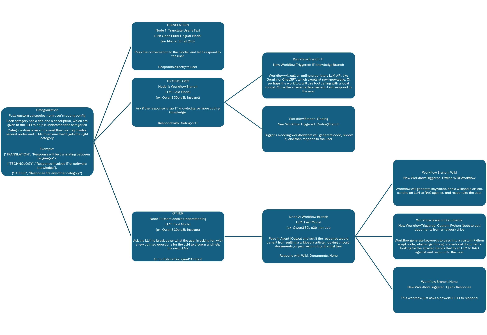
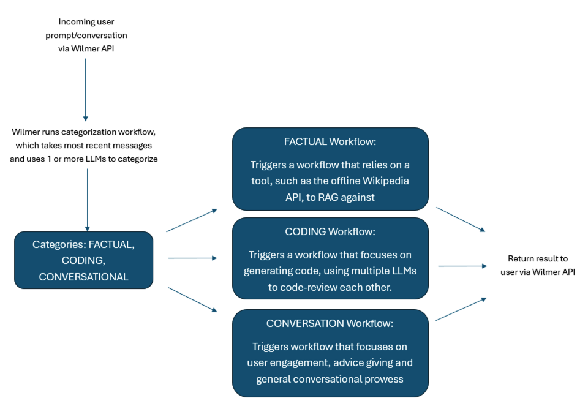
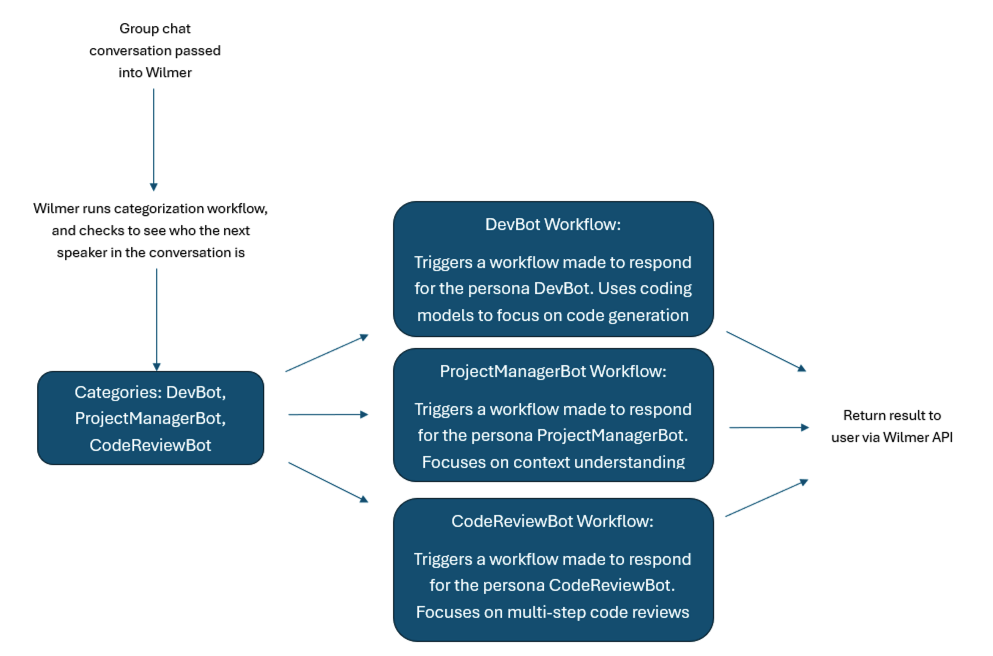
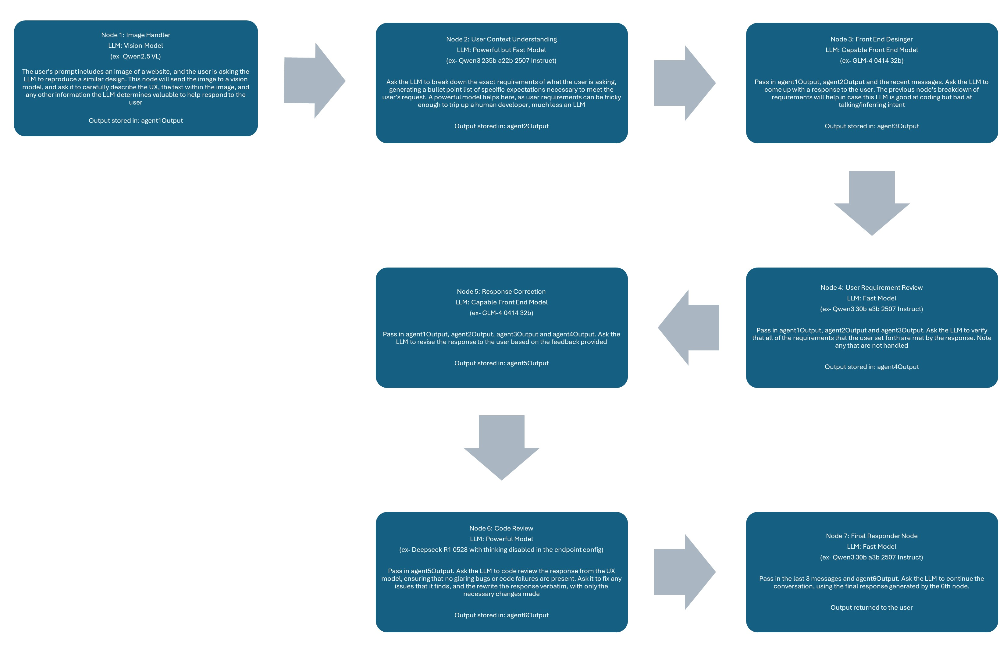

# WilmerAI

*"What If Language Models Expertly Routed All Inference?"*

## DISCLAIMER:

> This project is still under development. The software is provided as-is, without warranty of any kind.
>
> This project and any expressed views, methodologies, etc., found within are the result of contributions by the
> maintainer and any contributors in their free time and on their personal hardware, and should not reflect upon
> any of their employers.
>
> [The maintainer of this project, SomeOddCodeGuy, is not doing any Contract, Freelance, or Collaboration
> work.](https://github.com/SomeOddCodeGuy#disclaimer)

---

## Maintainer's Notes

> Minimum Python version is bumped up to 3.13.14/3.14.5. However, if you don't intend to use the web fetcher,
> you should be fine on 3.11.10/3.12.13. Web fetch is the only item that really requires the higher versions.
> So if you're already using Wilmer on a lower python, it should be fine.

---

## What is WilmerAI?

WilmerAI is an application designed for advanced semantic prompt routing and complex task orchestration. It
originated from the need for a router that could understand the full context of a conversation, rather than just the
most recent message.

Unlike simple routers that might categorize a prompt based on a single keyword, WilmerAI's routing system can analyze
the entire conversation history. This allows it to understand the true intent behind a query like "What do you think it
means?", recognizing it as historical query if that statement was preceded by a discussion about the Rosetta Stone,
rather than merely conversational.

This contextual understanding is made possible by its core: a **node-based workflow engine**. Like the rest of Wilmer,
the routing is a workflow, categorizing through a sequence of steps, or "nodes", defined in a JSON file.
The route chosen kicks off another specialized workflow, which can call more workflows from there. Each node can
orchestrate different LLMs, call external tools, run custom scripts, call other workflows, and many other things.

To the client application, this entire multi-step process appears as a standard API call, enabling advanced backend
logic without requiring changes to your existing front-end tools.

---

## Working with Workflows

### Configure Tool Use in Workflows

The below shows Open WebUI connected to 2 instances of Wilmer (recorded before multi-user support was added; a single
instance can now serve multiple users). The first instance just hits Mistral Small 3 24b directly, and then the second
instance makes a call to the [Offline Wikipedia API](https://github.com/SomeOddCodeGuy/OfflineWikipediaTextApi) before
making the call to the same model.

*Click the image to play gif if it doesn't start automatically*

### Iterative LLM Calls To Improve Performance

A zero-shot to an LLM may not give great results, but follow-up questions will often improve them. If you
regularly perform
[the same follow-up questions when doing tasks like software development](https://www.someoddcodeguy.dev/my-personal-guide-for-developing-software-with-ai-assistance/),
creating a workflow to automate those steps can have great results.

Results depend on the model, prompts, and task.

### Distributed LLMs

With workflows, you can have as many LLMs available to work together in a single call as you have computers to support.
For example, if you have old machines lying around that can run 3-8b models? You can put them to use as worker LLMs in
various nodes. The more LLM APIs that you have available to you, either on your own home hardware or via proprietary
APIs, the more your workflow network can do. A single prompt to Wilmer could reach out to 5+ computers,
including proprietary APIs, depending on how you build your workflow.

## Some (Not So Pretty) Pictures to Help People Visualize What It Can Do

#### Example of A Simple Assistant Workflow Using the Prompt Router

#### Example of How Routing Might Be Used

#### Group Chat to Different LLMs

#### Example of a UX Workflow Where A User Asks for a Website

## Key Features

* **Advanced Contextual Routing**
  The primary function of WilmerAI. It directs user requests using context-aware logic. This is handled
  by two mechanisms:
    * **Prompt Routing**: At the start of a conversation, it analyzes the user's prompt to select the most appropriate
      specialized workflow (e.g., "Coding," "Factual," "Creative").
    * **In-Workflow Routing**: During a workflow, it provides conditional "if/then" logic, allowing a process to
      dynamically choose its next step based on the output of a previous node.

  Routing decisions can use the **entire conversation history**, subject to the workflow's configured context limits.

---

* **Core: Node-Based Workflow Engine**
  The foundation that powers the routing and all other logic. WilmerAI processes requests using workflows, which are
  JSON files that define a sequence of steps (nodes). Each node performs a specific task, and its output can be passed
  as input to the next, enabling complex, chained-thought processes.

---

* **Multi-LLM & Multi-Tool Orchestration**
  Each node in a workflow can connect to a completely different LLM endpoint or execute a tool. This allows you to
  orchestrate the best model for each part of a task. For example, using a small, fast local model for summarization
  and a large cloud model for the final reasoning, all within a single workflow.

---

* **Modular & Reusable Workflows**
  You can build self-contained workflows for common tasks (like searching a database or summarizing text) and then
  execute them as a single, reusable node inside other, larger workflows. This simplifies the design of complex agents.

---

* **Stateful Conversation Memory**
  To provide the necessary context for long conversations and accurate routing, WilmerAI uses a four-part memory
  system: a chronological summary file, a continuously updated "rolling summary" of the entire chat, a searchable
  vector database (keyword search by default, with optional embedding-based semantic/hybrid search), and a
  continuously maintained state document describing the current state of the conversation.

---

* **Adaptable API Gateway**
  WilmerAI's "front door." It exposes OpenAI- and Ollama-compatible API endpoints, allowing you to connect your existing
  front-end applications and tools without modification.

---

* **Tool Calling & Structured Output**
  OpenAI-style tool calling passthrough, including multi-round tool loops through authored-prompt
  workflows (`appendNativeToolExchange`). On backends with constrained decoding (llama.cpp, Ollama, LM Studio, vLLM,
  OpenAI), demanded tool calls (`tool_choice` forced or `required`) use the supported backend constraint mechanism.
  LLM nodes can request a JSON Schema through `structuredOutputFile` for routing, extraction, or classification;
  support and enforcement depend on the backend. See
  `Docs/User_Documentation/Core_Features/Tool_Calling_And_Structured_Output.md`.

---

* **Flexible Backend Connectors**
  WilmerAI's "back door." It connects to various LLM backends (OpenAI, Ollama, KoboldCpp) using a simple
  configuration system of **Endpoints** (the address), **API Types** (the schema/driver), and **Presets** (the
  generation parameters).

---

- **Agentic MCP Tool Integration:** Experimental support for agentic MCP server tool
  calling, allowing the model to discover and use tools mid-workflow. Originally
  contributed by [iSevenDays](https://github.com/iSevenDays); big thank you for the
  amazing work on this feature. The transport has since been migrated to the official
  MCP SDK (MCPO remains supported as a legacy option). More info can be found in the
  [ReadMe](Public/workflow_python_scripts/_isevendays_mcp_scripts/README_MCP_TOOLS.md)

---

- **Privacy First Development:** At its core, Wilmer is continually designed with the
  principle of being completely private. Socg uses this application constantly, and doesn't
  want his information getting blasted out to the net any more than anyone else does. As such,
  every decision that is made is focused on the idea that the only incoming and outgoing calls
  from Wilmer should be things that the user expects, and actively configured themselves.

---

#### Privacy Check (2026-09-07)

For my own edification, to ensure I didn't accidentally add something that would negatively impact
Wilmer's privacy posture, I'll sometimes ask the coding agent I am working with to do an end-to-end check to look for any
outbound calls or other data leakage. It's not as good as a formal code audit, but it gives me
peace of mind. I've included the results of the check here.

I've been doing this check whenever I make a really big set of changes, just to make sure
that I didn't introduce something I didn't intend to via a library or sloppy coding.

This informal check was performed using Codex (GPT-6 Astra), most recently on 2026-09-07.
It looks for outbound network calls, telemetry, or other privacy-relevant behavior. The results listed
below were generated for my own personal use and were shared for transparency; **they are not a
guarantee**.

If privacy matters to your deployment, please run your own analysis before using WilmerAI.

This inventory comes from a static review of the release source, including application code, shipped Python helpers,
server entry points and launchers. Offline tests provided additional evidence about request isolation, logging and
storage boundaries. It does not certify external services, dependency internals or live network behavior.

| Outbound boundary | Trigger, destination and data |
| --- | --- |
| LLM and embedding transports | Configured workflow and memory operations send prompts, images, tools, schemas or memory text to configured endpoints. Explicitly configured backups may receive a failed primary request. |
| Offline wiki tools | Enabled workflow features send queries to configured services with loopback defaults. Retrieval inside those services is outside this inventory. |
| WebFetch | An explicit node sends its configured URL, method, body and headers through Requests or selected system curl. Proxies and optional destination guards are operator-controlled; TLS verification defaults on. |
| WebPageFetch | An explicit page node retrieves its configured URL and, by default, robots.txt at that origin. Page and robots.txt requests can follow redirects when enabled. |
| CurlCommand | A trusted workflow node launches system curl with configured arguments. Operator-selected options can intentionally access files or services. |
| MCPToolCall | An explicit node selects its configured stdio process, SSE service or streamable HTTP service and sends tool arguments and configured headers/environment. |
| Shipped MCPO helpers | Explicit PythonModule workflows retrieve schemas and execute selected tools at a configured or environment-supplied MCPO destination, with a loopback default. |
| WilmerProxy | Explicit proxy mode relays allowed model requests to configured upstreams using the chosen authentication/header policy. |
| Embedding backfill | An operator-run script sends selected memory text to its supplied embedding URL. The server does not run it automatically. |
| Launcher setup | Operator-started shell/batch launchers can install requirements with pip and its configured registries. Installation traffic is separate from application requests. |

No telemetry, analytics, automatic update service or unrelated runtime download was identified in the reviewed
application code. No hardcoded public-internet request destinations were identified in the reviewed runtime code.
Editable endpoint examples do include OpenAI and Anthropic provider URLs; using those configurations can send
requests to those providers.

Runtime requests originate from configured services, user-selected URLs, or explicitly enabled workflow features.
Redirects can derive subsequent request destinations. WebPageFetch starts robots.txt requests at the selected page's
origin; both page and robots.txt responses may lead to other destinations when redirects are enabled.

In the offline Middleware import checks performed for this review, no network access, subprocess creation, or
runtime writes were observed. No live endpoint or packet-capture test was used for this inventory.

The reviewed built-in HTTP code did not add personal contact information or a project-specific User-Agent.
Operator-configured headers, proxy credentials, tool environments and custom scripts can affect what is sent.
Requests-based tools may also use environment-provided proxy or authentication settings; WebPageFetch and
WilmerProxy disable those ambient settings. Application-level destination checks are not a substitute for
network-level enforcement where required. WilmerProxy's model allowlist is not client authentication and does
not hide model names inside upstream responses.

**Storage and diagnostics**

- An API key selects a key-scoped discussion directory independently of encryption. Custom workflow file paths
  must use that directory scope to share its isolation.
- With `encryptUsingApiKey` enabled and a key supplied, supported discussion JSON and built-in state documents
  use Fernet encryption on writes. Preserve the original API key and workflow selection to read encrypted files;
  disabling encryption does not decrypt them. Existing plaintext is not encrypted merely by reading it, and
  backups can retain earlier plaintext.
- Custom text remains plaintext. SQLite vector memory contains readable text, metadata and embeddings; workflow
  lock databases can contain discussion identifiers. These databases are not encrypted by this feature.
- Configuration files can contain plaintext operator credentials and require separate protection.
- When redaction is not enabled, diagnostic logging may contain prompts, model responses, tool payloads, or other
  request content, depending on the request path and configured log level. Some content is logged at INFO as well
  as DEBUG.
- Built-in request redaction activates through `redactLogOutput`, or through `encryptUsingApiKey` when a key is
  supplied. The reviewed paths apply that policy to request diagnostics, including errors and cleanup logging.
  Offline tests covered redacted and unredacted requests; they do not establish that every possible path is covered.
- Custom Python must use the logging helpers itself. Independent third-party loggers, startup print messages and
  external services are outside this request-redaction policy.

**Dependencies and extension boundaries**

Runtime/test dependencies are pinned in requirements.txt and requirements-test.txt. Exact installed pins and offline
compatibility tests are evidence about the tested environment, not a security audit of every dependency.

Handler discovery imports packaged code, and LLM handlers use a fixed factory. PythonModule nodes execute selected
Python with process privileges and are not sandboxed. HTTP image URLs are forwarded to the configured provider rather
than fetched by this application. Author-controlled file paths, SQL and subprocess options are trusted configuration.

This is an AI-assisted source review, not a formal third-party audit or privacy guarantee. Operators should assess
their configured services, scripts, credentials and storage independently.

> While I do not have the tools to make a 100% guarantee claim there is not a third party
> library doing something I'm not expecting, I wanted to make a point
> that this is something that is important to me. I highly recommend, if you have
> any concerns, that you run your own analysis of the codebase and app. Please open an issue
> if you ever find anything that I've missed.

## User Documentation

User Documentation can be found by going to [/Docs/User_Documentation/](Docs/User_Documentation/README.md)

## Developer Documentation

Helpful developer docs can be found in [/Docs/Developer_Docs/](Docs/Developer_Docs/README.md)

## Setup

To use **all features, including `WebPageFetch`**, use **Python 3.13.14 or a later 3.13 patch**, or
**3.14.5 or a later 3.14 patch**. Existing installations that do not use `WebPageFetch` are expected to continue
working on **3.11.10 or a later 3.11 patch**, or **3.12.13 or a later 3.12 patch**.

Development uses **Python 3.14.6**, pinned in [`.python-version`](.python-version). That exact patch is not required
for end users. Complete dependency installations and the full suite have not yet been validated on Python 3.11
or 3.12.

### Guides

#### WilmerAI

Follow the [setup guide](Docs/User_Documentation/Setup/_Getting-Start_Wilmer-Api.md) to configure and start the API.

#### Wilmer with Open WebUI

[You can click here to find a written guide for setting up Wilmer with Open WebUI](Docs/User_Documentation/Setup/Open-WebUI.md)

#### Wilmer With SillyTavern

[You can click here to find a written guide for setting up Wilmer with SillyTavern](Docs/User_Documentation/Setup/SillyTavern.md).

---

## Why Make WilmerAI?

Wilmer was kicked off in late 2023, during the Llama 2 era, to make maximum use of fine-tunes through routing.
The routers that existed at the time didn't handle semantic routing well- often categorizing was based on a single
word and the last message only; but sometimes a single word isn't enough to describe a category, and the last
message may have too much inferred speech or lack too much context to appropriately categorize on.

Almost immediately after Wilmer was started, it became apparent that just routing wasn't enough: the finetunes were ok,
but nowhere near as smart as proprietary LLMs. However, when the LLMs were forced to iterate on the same task over and
over, the quality of their responses tended to improve (as long as the prompt was well written). This meant that the
optimal result wasn't routing just to have a single LLM one-shot the response, but rather sending the prompt to
something
more complex.

Instead of relying on unreliable autonomous agents, Wilmer became focused on semi-autonomous Workflows, giving the
user granular control of the path the LLMs take, and allow maximum use of the user's own domain knowledge and
experience. This also meant that multiple LLMs could work together, orchestrated by the workflow itself,
to come up with a single solution.

Rather than routing to a single LLM, Wilmer routes to many via a whole workflow.

This has allowed Wilmer's categorization to be far more complex and customizable than most routers. Categorization is
handled by user defined workflows, with as many nodes and LLMs involved as the user wants, to break down the
conversation and determine exactly what the user is asking for. This means the user can experiment with different
prompting styles to try to make the router get the best result. Additionally, the routes are more than just keywords,
but rather full descriptions of what the route entails. Little is left to the LLM's "imagination". The goal is that
any weakness in Wilmer's categorization can be corrected by simply modifying the categorization workflow. And once
that category is chosen? It goes to another workflow.

Eventually Wilmer became more about Workflows than routing, and an optional bypass was made to skip routing entirely.
Because of the small footprint, this means that users can run multiple instances of Wilmer- some hitting a workflow
directly, while others use categorization and routing.

While Wilmer may have been the first of its kind, many other semantic routers have since appeared; some of which are
likely faster and better. But this project will continue to be maintained for a long time to come, as the maintainer
of the project still uses it as his daily driver, and has many more plans for it.

## Wilmer API Endpoints

### How Do You Connect To Wilmer?

Wilmer exposes several different APIs on the front end, allowing you to connect most applications in the LLM space
to it.

Wilmer exposes the following APIs that other apps can connect to it with:

- OpenAI Compatible v1/completions (*requires [Wilmer Prompt Template](Public/Configs/PromptTemplates/wilmerai.json)*)
- OpenAI Compatible chat/completions
- Ollama Compatible api/generate (*requires [Wilmer Prompt Template](Public/Configs/PromptTemplates/wilmerai.json)*)
- Ollama Compatible api/chat

### What Wilmer Can Connect To

On the backend, Wilmer is capable to connecting to various APIs, where it will send its prompts to LLMs. Wilmer
currently is capable of connecting to the following API types:

- Claude API (Anthropic Messages API)
- OpenAI Compatible v1/completions
- OpenAI Compatible chat/completions
- Ollama Compatible api/generate
- Ollama Compatible api/chat
- KoboldCpp Compatible api/v1/generate (*non-streaming generate*)
- KoboldCpp Compatible /api/extra/generate/stream (*streaming generate*)

Wilmer supports both streaming and non-streaming connections, and has been tested using both Sillytavern
and Open WebUI.

## Maintainer's Note:

> This project is being supported in my free time on my personal hardware. I do not have the ability to contribute to
> this during standard business hours on
> weekdays due to work, so my only times to make code updates are weekends, and some weekday late nights.
>
> If you find a bug or other issue, a fix may take a week or two to go out. I apologize in
> advance if that ends up being the case, but please don't take it as meaning I am not taking the
> issue seriously. In reality, I likely
> won't have the ability to even look at the issue until the following Friday or Saturday.
>
> -Socg

## IMPORTANT:

> Please keep in mind that workflows, by their very nature, could make many calls to an API endpoint based on how you
> set them up. WilmerAI does not track token usage, does not report accurate token usage via its API, nor offer any
> viable
> way to monitor token usage. So if token usage tracking is important to you for cost reasons, please be sure to keep
> track of how many tokens you are using via any dashboard provided to you by your LLM APIs, especially early on as you
> get used to this software.
>
>Your LLM directly affects the quality of WilmerAI. This is an LLM driven project, where the flows and outputs are
> almost
> entirely dependent on the connected LLMs and their responses. If you connect Wilmer to a model that produces lower
> quality outputs, or if your presets or prompt template have flaws, then Wilmer's overall quality will be much lower
> quality as well. It's not much different than agentic workflows in that way.

---

## Contact

For feedback, requests, or just to say hi, you can reach me at:

WilmerAI.Project@gmail.com

---

## Third Party Libraries

WilmerAI imports several libraries within its requirements.txt, and imports the libraries via import statements; it does
not extend or modify the source of those libraries.

The libraries are:

* Flask : https://github.com/pallets/flask/
* requests: https://github.com/psf/requests/
* urllib3: https://github.com/urllib3/urllib3/
* jinja2: https://github.com/pallets/jinja
* pillow: https://github.com/python-pillow/Pillow
* eventlet: https://github.com/eventlet/eventlet
* waitress: https://github.com/Pylons/waitress
* cryptography: https://github.com/pyca/cryptography
* mcp: https://github.com/modelcontextprotocol/python-sdk
* PySocks: https://github.com/Anorov/PySocks

Further information on their licensing can be found within the README of the ThirdParty-Licenses folder, as well as the
full text of each license and their NOTICE files, if applicable, with relevant last updated dates for each.

## Wilmer License and Copyright

    WilmerAI
    Copyright (C) 2024-2026 Christopher Smith

    This program is free software: you can redistribute it and/or modify
    it under the terms of the GNU General Public License as published by
    the Free Software Foundation, either version 3 of the License, or
    (at your option) any later version.

    This program is distributed in the hope that it will be useful,
    but WITHOUT ANY WARRANTY; without even the implied warranty of
    MERCHANTABILITY or FITNESS FOR A PARTICULAR PURPOSE. See the
    GNU General Public License for more details.

    You should have received a copy of the GNU General Public License
    along with this program.  If not, see <https://www.gnu.org/licenses/>.
